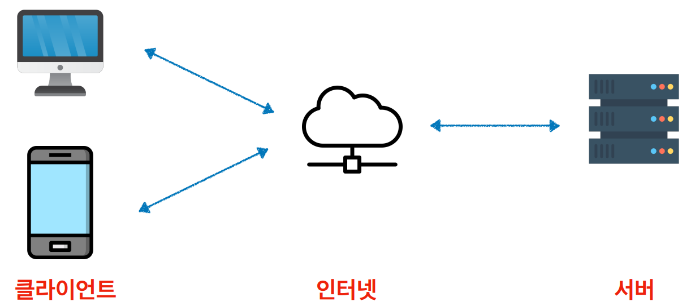
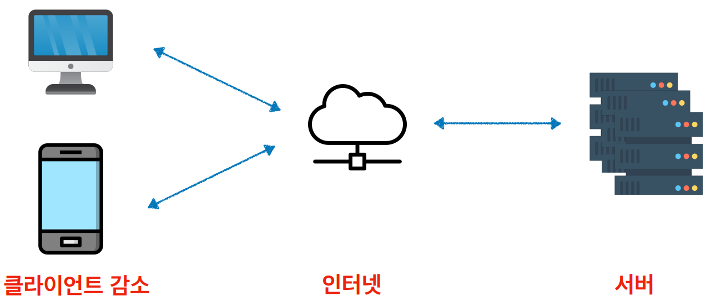
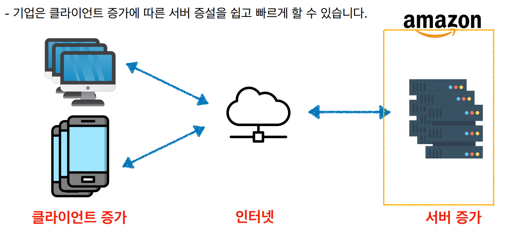
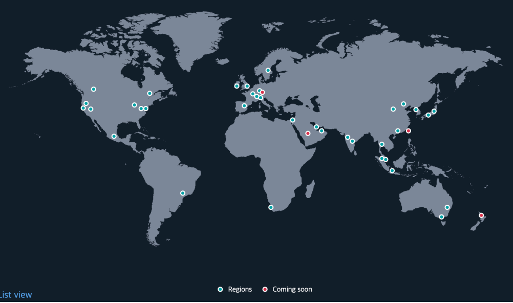
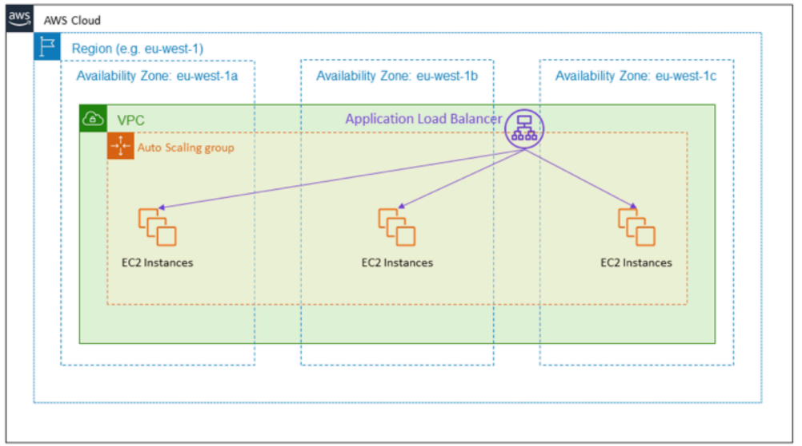
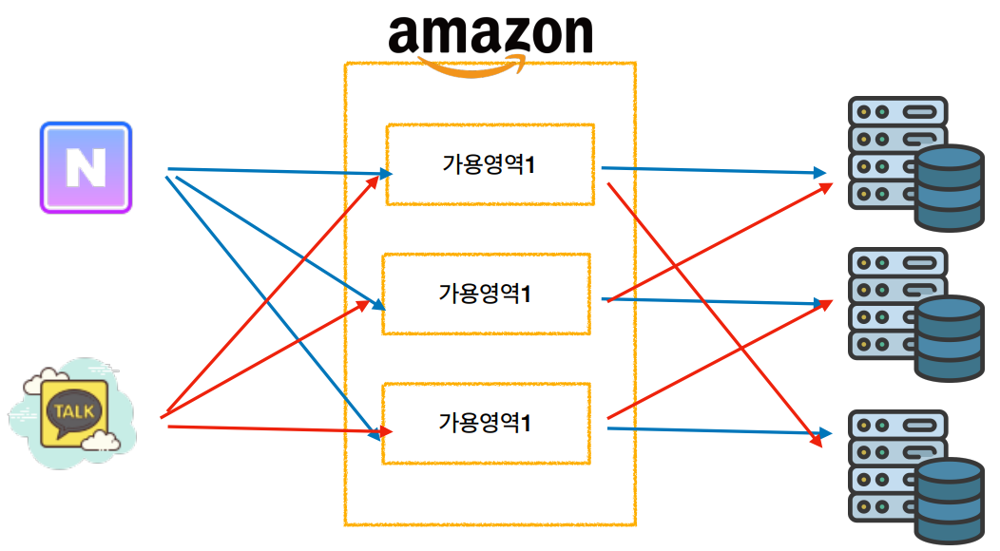

# [서버-클라이언트 아키텍쳐](https://www.theknowledgeacademy.com/blog/client-server-architecture/)
- 기업(서버)이 고객(클라이언트)에게 서비스를 제공하는 아키텍처를 말합니다.

---
- 고객이 증가하게 된다면, 기업은 더 많은 서버를 구매해야 합니다.

---
- 갑자기 고객이 감소하게 된다면, 기업은 필요하지 않은 서버를 유지해야하는 어려움이 생깁니다.

---
# [AWS(클라우드컴퓨팅)](https://aws.amazon.com/ko/what-is-cloud-computing/)
- AWS은 인터넷을 통해 원격으로 서버(가상 컴퓨터)를 **온디멘드**로 제공하고 사용한 만큼만 비용을 지불하는 서비스입니다.
  - **온디멘드(On Demand)**: 주문형 서비스
- 따라서 AWS은 기존 서버-클라이언트 아키텍쳐에 대한 문제점을 해결할 수 있습니다.
  - 고객이 증가하면, 서버를 더 많이 빌린다.
  - 고객이 감소하면, 빌린 서버를 줄인다.

---

---

---
## [AWS 글로벌 인프라](https://aws.amazon.com/ko/about-aws/global-infrastructure/?p=ngi&loc=0)

---
### Region(리전)
- AWS가 전 세계에서 데이터 센터를 클러스터링하는 물리적 위치를 리전이라고 합니다.
- 리전에는 여러 개의 가용영역이 있습니다.

---
- AWS는 리전을 통해 전세계에 서비스를 제공하고 있습니다.

---
### Availability Zone(가용영역)
- 가용영역은 하나 이상의 개별 데이터 센터로 구성됩니다.
- 여러 가용영역에 걸쳐 서비스를 적용하면, 정전, 낙뢰, 지진 등과 같은 문제로 부터 안전하
게 보호됩니다

---
- 여러 가용영역에 걸쳐서 서비스를 제공할 수 있습니다.

---
- AWS는 물리적인 가용영역을 각 가용영역 이름에 무작위로 매핑합니다.

