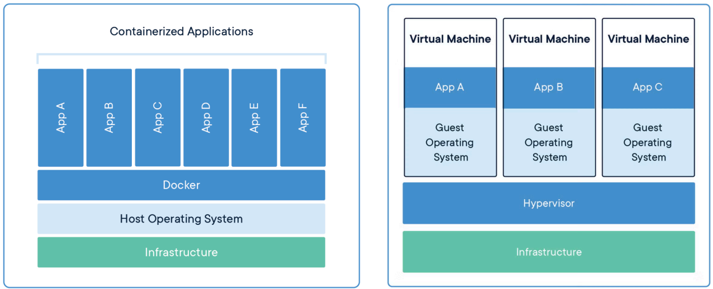

# [Docker란?](https://aws.amazon.com/ko/docker/)
- Docker는 애플리케이션을 신속하게 구축, 테스트 및 배포할 수 있는 소프트웨어 플
랫폼입니다.
- Docker는 소프트웨어를 컨테이너라는 표준화된 유닛으로 패키징하며, 이 컨테이너
에는 라이브러리, 시스템 도구, 코드, 런타임 등 소프트웨어를 실행하는 데 필요한 모
든 것이 포함되어 있습니다.
- Docker를 사용하면 환경에 구애받지 않고 애플리케이션을 신속하게 배포 및 확장할
수 있으며 코드가 문제없이 실행될 것임을 확신할 수 있습니다.

---
## Docker vs VirtualMachine
- **Docker**는 컨테이너를 위한 운영 체제입니다.  **VirtualMachine(가상 머신)** 이 서버 하드웨어를 가상화하는 방식과 비슷하게(직접 관리해야 하는 필요성 제거) 컨테이너는 서버 운영 체제를 가상화합니다.

---
## Docker Container 생성방법
- Build 명령어
  - docker image build -t 이미지명 Dockerfile 경로
- Run 명령어
  - docker run -d —name 컨테이너 이름
    - `-d`: 컨테이너를 백그라운드에서 실행

---
## Docker 구성요소
- **Docker Client**
  - 도커를 설치하면 그것이 Client이며, build, pull, run 등의 도커 명령어를 수행
- **Docker Host**
  - 도커가 띄워져있는 서버
- **Docker daemon**
  - 도커 엔진
- **Registry**
  - 외부(remote) 이미지 저장소

---

---
# [CI/CD(ContinuousIntegration/ContinuousDelivery)](https://wandb.ai/wandb/articles/reports/What-are-continuous-integration-and-continuous-delivery-CI-CD-in-machine-learning---VmlldzoxMDg5NDQ1Mw)
- CI/CD는 지속적 통합(Continuous Integration)과 지속적 제공/배포(Continuous Delivery/Deployment)를 의미하는 약자로, 소프트웨어 개발의 효율성을 높이고 품질을 보장하는데 도움을 줍니다.
- CI/CD의 주요기능
  - 코드 변경 사항을 자동으로 통합하고, 배포
  - 개발 팀과 운영 팀 간의 공동 작업을 개선
  - 배포를 더 빠르게 그리고 더 자주 할 수 있음

---

---
# [CI/CD > AWS CodePipeline](https://aws.amazon.com/ko/codepipeline/)
- AWS에서 제공하는 CI/CD 전용 CodePipeline입니다.

---
## [AWS CodePipeline > Github](https://github.com/)
- Github은 소스 코드를 관리하고 공유할 수 있는 웹 서비스로, 버전 관리 시스템인 깃(Git)을 기반으로 합니다.
- Github은 개발자들이 프로젝트를 효율적으로 관리하고 협업할 수 있도록 지원합니다.
- Github 특징
  - 공개 저장소 생성은 무료이고, 비공개 저장소는 작업자 3인 이하인 경우에 무료입니다.
  - 프로젝트를 공개 저장소로 만들면 전 세계 개발자와 협업할 수 있습니다.

---
## [AWS CodePipeline > CodeBuild](https://aws.amazon.com/ko/codebuild/)
- 소스 코드를 컴파일하는 단계부터 테스트 실행 후 소프트웨어 패키지를 개발하여 배포하는 단계까지 마칠 수 있는 완전관리형의 지속적 통합 서비스입니다.
- CI/CD 중 CI를 담당하는 서비스
- 빌드 서버를 관리 및 확장할 필요가 없음
- 간단하게 빌드 세팅이 된 서버 하나 빌려서 사용하는 개념

---
## [AWS CodePipeline > CloudFormation(Deploy)](https://docs.aws.amazon.com/ko_kr/AWSCloudFormation/latest/UserGuide/Welcome.html)
- **What**
  - 인프라를 코드로 구성할 수 있는 무료 서비스
- **When**
  - 인프라를 자동으로 프로비전(배포)하고 싶을 때
  - 정형화된 아키텍처를 코드화 시켜 관리하고 싶을 때
  - 인프라의 프로비전 및 업데이트 과정을 관리하고 싶을 때
- **How**
  - 코드 기반으로 AWS 인프라를 여러 리전에 자동으로 프로비전 하거나 업데이트
  - 프로비전/업데이트 과정에서 오류 발생시 자동으로 롤백

---
### AWS CloudFormation 주요개념
- **탬플릿(Template)**
  - JSON or YAML 형식의 텍스트 파일로 AWS 인프라를 구성하는 리소스들의 청사진
  - 프로비전할 리소스를 정의하고 리소스간의 관계를 정의
- **논리적 리소스**
  - 템플릿 + 사용자의 파라미터/프로비전 시점의 값들
- **스택(Stack)**
  - CloudFormation으로 리소스를 프로비전할 때 관련된 리소스를 묶은 단위

---
### [AWS CloudFormation 작동방식](https://docs.aws.amazon.com/ko_kr/AWSCloudFormation/latest/UserGuide/cloudformation-overview.html)
1. 템플릿을 수정한다.
2. 수정된 템플릿을 S3 혹은 로컬에 저장한다.
3. CloudFormation은 수정된 템플릿 혹은 파라미터를 기반으로 변경 세트(Change Set)을 생
성한다.
4. 변경된 세트를 통해 변경 사항을 확인 후 변경 세트를 실행한다.
5. 실행된 변경 세트는 스텍을 업데이트한다.

---

---
## [AWS CodePipeline > S3](https://aws.amazon.com/ko/s3/)
- Amazon Simple Storage Service(S3)는 업계 최고 수준의 확장성, 데이터 가용성, 보안 및 성능을 제공하는 객체 스토리지 서비스입니다. 

---
## [AWS CodePipeline > ECR](https://aws.amazon.com/ko/ecr/)
- Amazon Elastic Container Registry(Amazon ECR)는 어디서나 애플리케이션 이미지 및 아티팩트를 안정적으로 배포할 수 있도록 뛰어난 성능 호스팅을 제공하는 완전관리형 컨테이너 레지스트리입니다.

---
## [AWS CodePipeline > ECS](https://aws.amazon.com/ko/ecs/)
- 애플리케이션과 필요한 리소스를 설명하기만 하면 Amazon ECS가 유연한 컴퓨팅 옵션 전반에서 애플리케이션을 시작, 모니터링 및 규모 조정하여 애플리케이션에 필요한 다른 지원 AWS 서비스와 자동으로 통합합니다. 

---

