# 전체 아키텍처


---
# 코드 수정 및 Github 반영

---
### 단계1: 코드 수정 
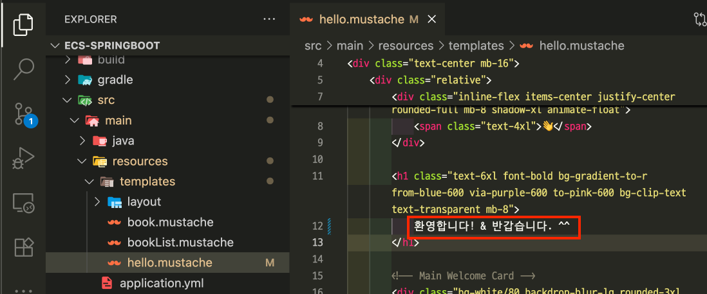

---
### 단계2: Commit
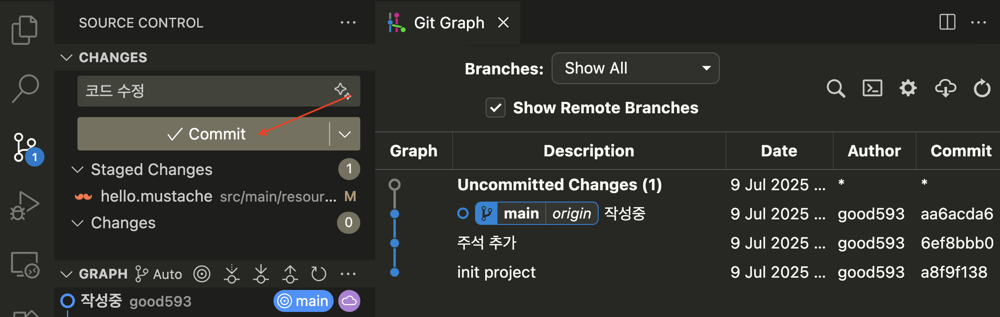

---
### 단계3: Github 반영
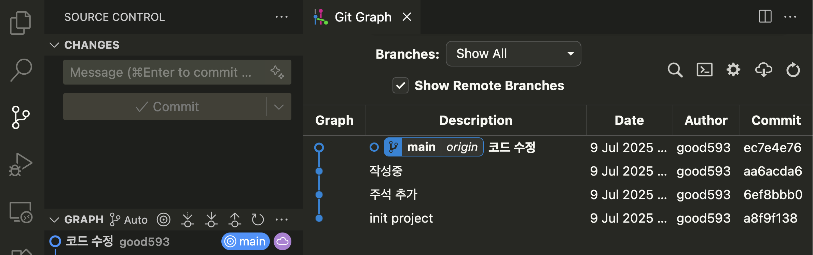

---
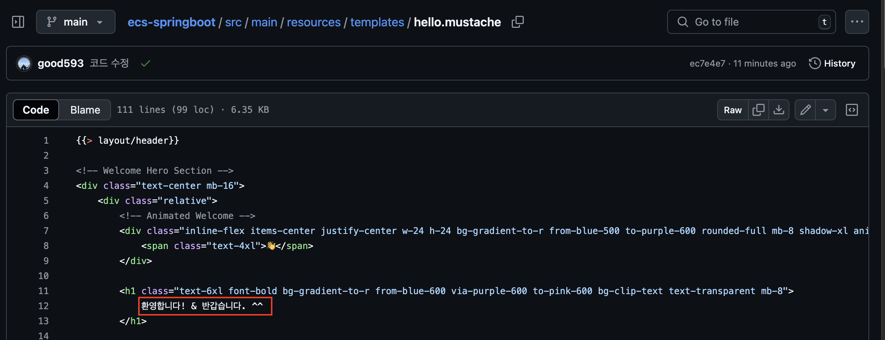

---
# CodePipeline
- AWS CodePipeline은 AWS에서 제공하는 지속적 통합(CI) 및 지속적 배포(CD) 서비스를 위한 자동화 파이프라인 도구입니다.

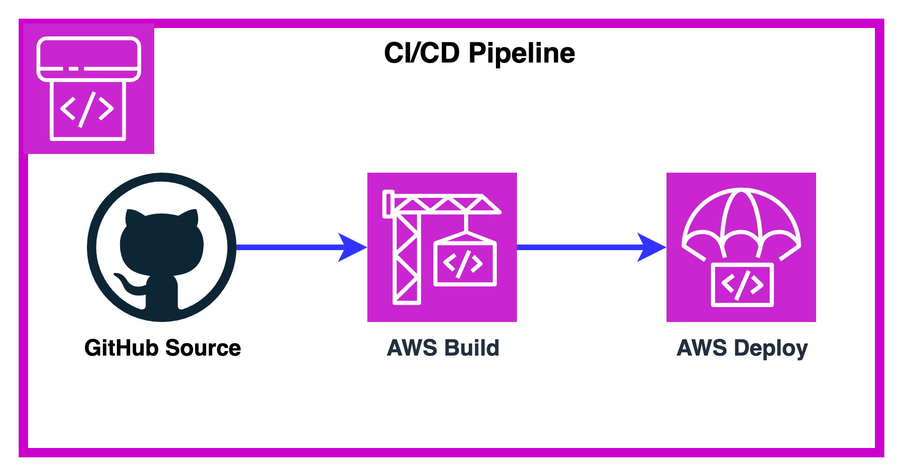

---
### 단계1: CodePipeline 접속 
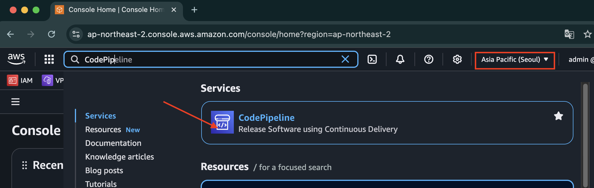

---
### 단계2: Create pipeline
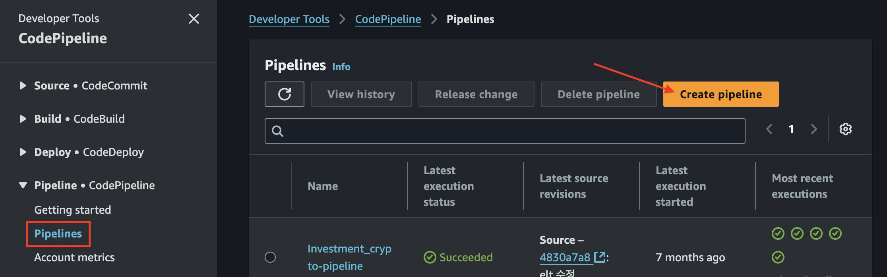

---
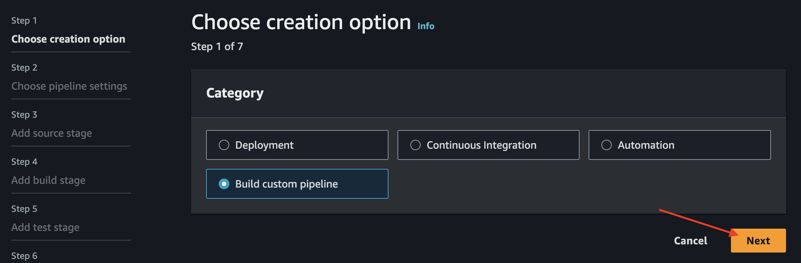

---
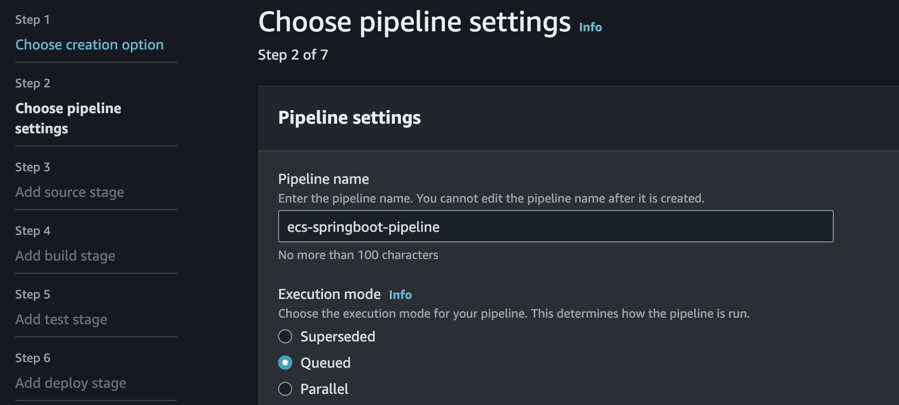

---
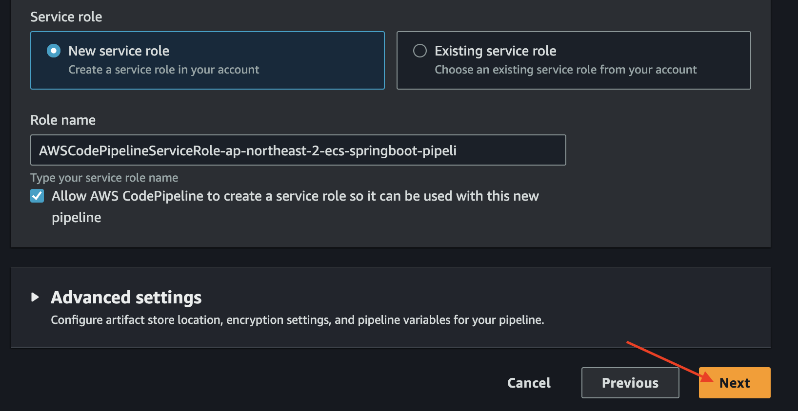

---
### 단계3: Source(Github)
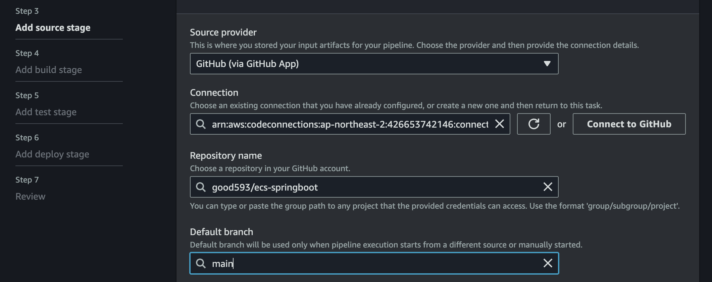

---
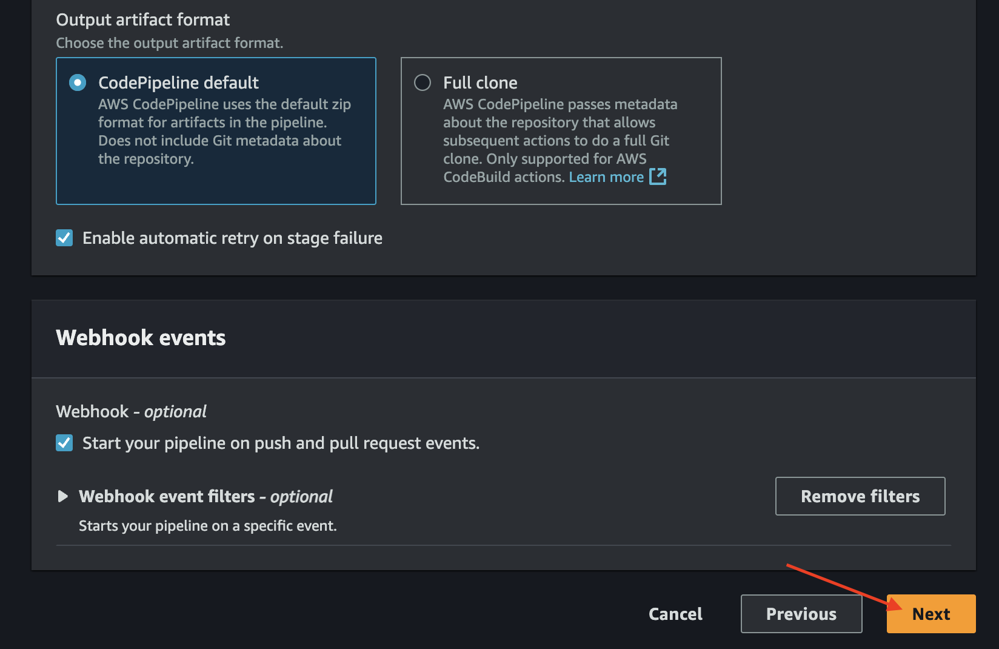

---
### 단계4: Build
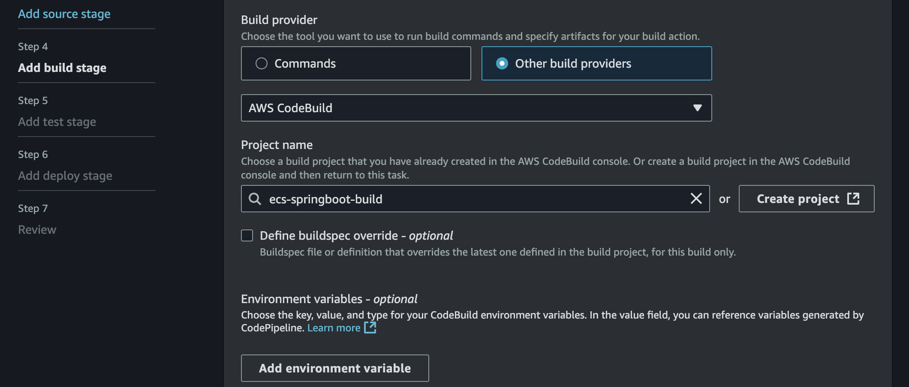

---
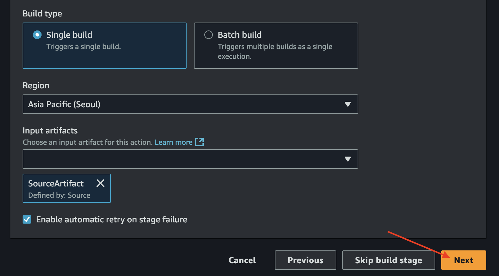

---
### 단계5: Test
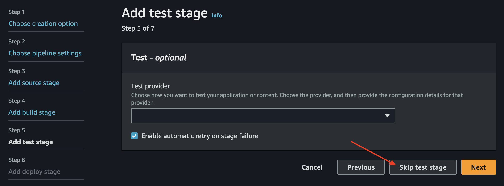

---
### 단계6: Deploy
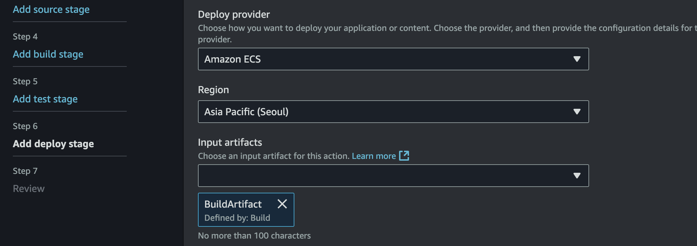

---
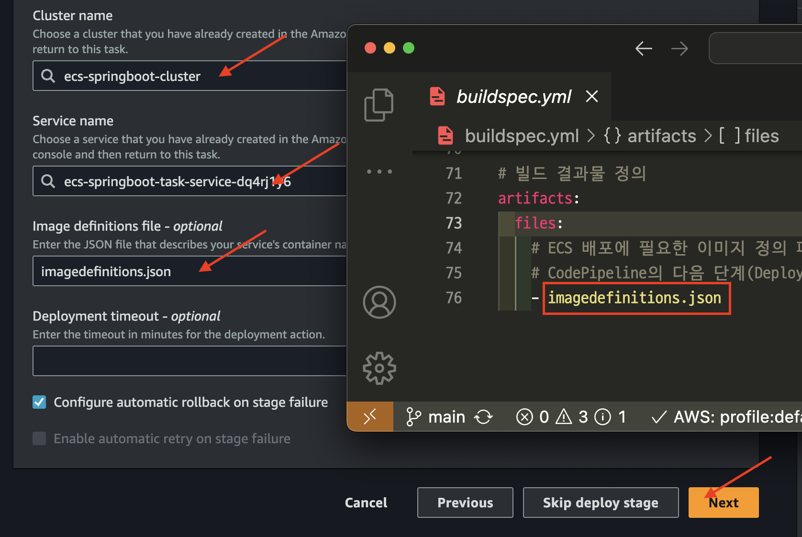

---
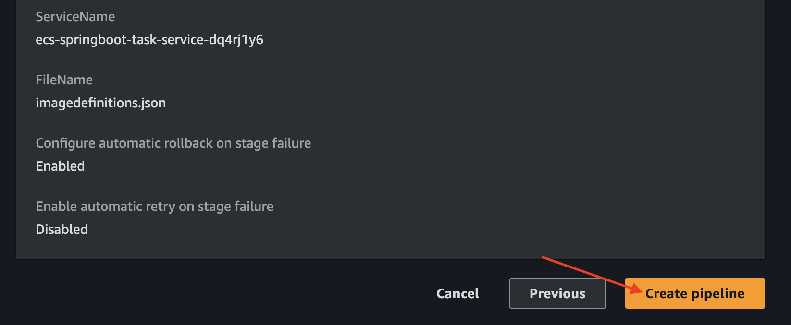

---
### 단계7: 성공
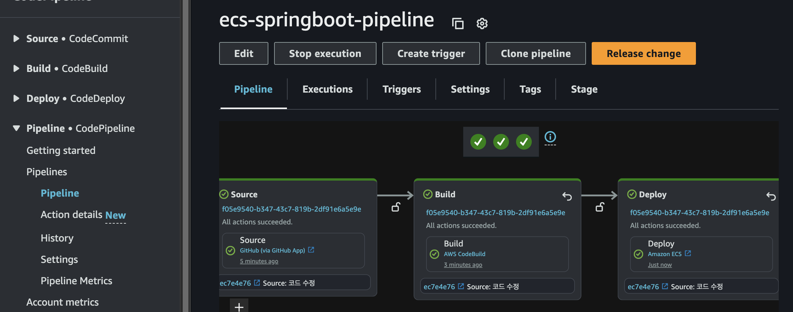

---
# 변경된 내용 확인 

---
### 단계1: ECS Public IP 복사 
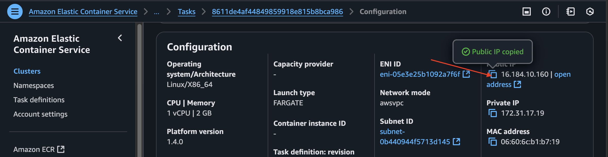

---
### 단계2: 확인
```shell
http://[Public IP]:8080/hello
```


