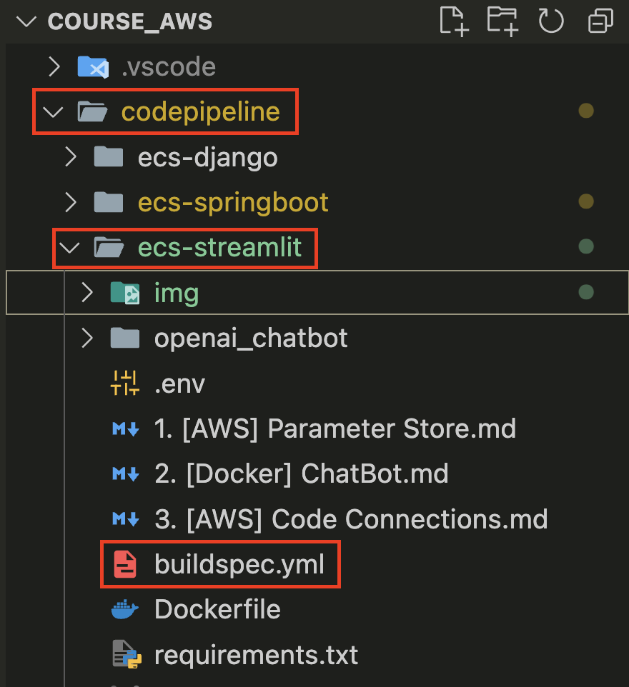

# [AWS CodeBuild](https://docs.aws.amazon.com/ko_kr/codebuild/latest/userguide/welcome.html)
- AWS CodeBuild 는 클라우드의 완전 관리형 빌드 서비스입니다. 는 소스 코드를 CodeBuild 컴파일하고, 단위 테스트를 실행하고, 배포할 준비가 된 아티팩트를 생성합니다.

---
## [Create buildspec.yml](https://docs.aws.amazon.com/ko_kr/codebuild/latest/userguide/build-spec-ref.html)

---

---
## Create CodeBuild

---
### 단계1: CodePipeline 접속 

---
### 단계2: Create project

---
### 단계3: Project configuration

---
### 단계4: Source

---

---
### 단계5: Environment

---
- 생성된 CodeBuild Role Name 확인 

---
### 단계6: Github에서 buildspec.yml 위치 확인 

---
- Buildspec name에 해당 위치 정보 작성 

---
### 단계7: Create build project

---
## Add Permission

---
### 단계1: IAM 접속 

---
### 단계2: CodeBuild Role 조회 및 선택 

---
### 단계3: Attach policies

---
### 단계4: Add permissions
> `AmazonEC2ContainerRegistryPowerUser`

---

---
## Start CodeBuild

---
### 단계1: CodePipeline 접속 

---
### 단계2: Build projects > Start now

