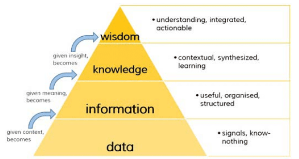
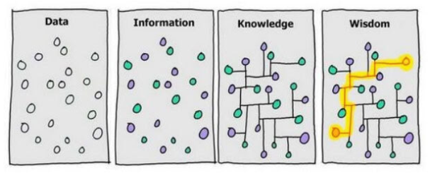
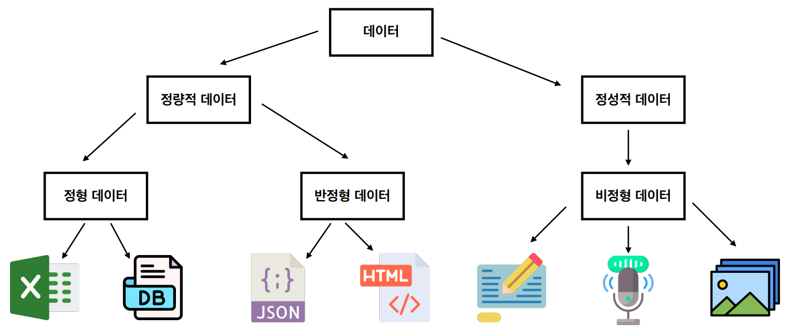
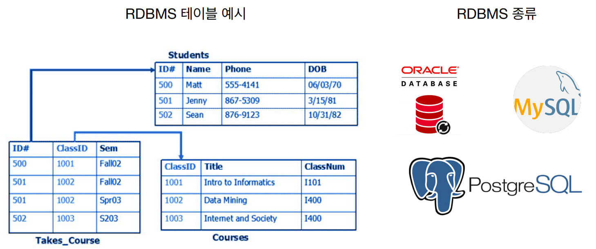
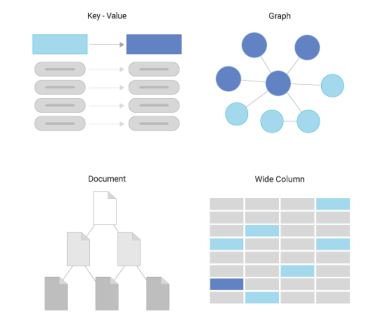
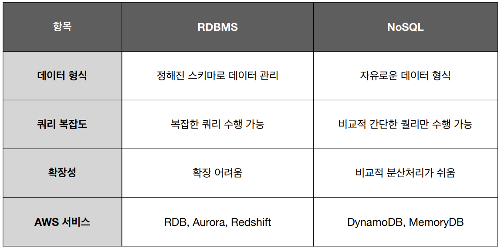
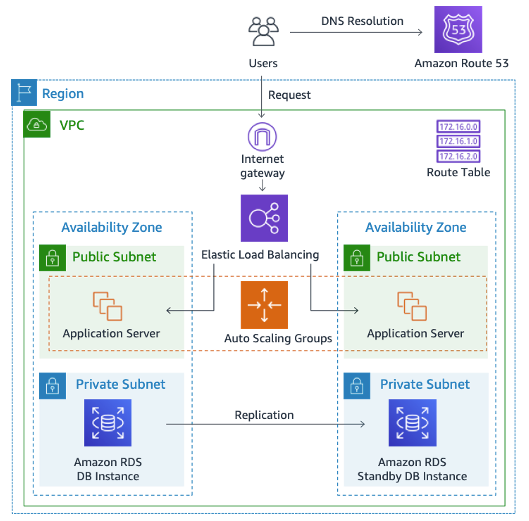
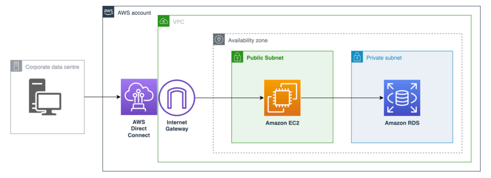

# [데이터란?](https://ko.wikipedia.org/wiki/%EC%9E%90%EB%A3%8C)
- 데이터의 사전적 정의는 `"이론을 세우는 데 기초가 되는 사실. 또는 바탕이 되는 자료"`(네이버 사전)라고 합니다. 
- 컴퓨터 용어 사전에는 `"프로그램을 운용할 수 있는 형태로 기호화·숫자화한 자료"`(옥스포드 컴퓨터 용어 사전)라고 되어 있습니다.

---
## [DIKW 피라미드](https://www.jeffwinterinsights.com/insights/dikw-pyramid)

- 데이터는 그 자체로 실용적인 가치가 있는 것이 아니라, 가공하고 분석하고 결합함으로써 가치가 생깁니다. 
- 어떤 관점에서 어떤 방법으로 분석하느냐에 따라 그 실용적 가치가 크게 달라질 수 있습니다. 

---
- 첫 번째, 데이터는 정보를 구성하는 단위입니다.
- 두 번째, 정보는 지식을 구성하는 단위입니다.
- 마지막으로, 지식은 지혜를 구성하는 단위입니다.

---
## 데이터 종류
- 일반적으로 데이터의 종류에는 3가지로 나눌 수 있다. 정형 데이터, 반정형 데이터, 비정형 데이터
- 스키마(schema)
  -  데이터의 구조와 제약 조건에 대한 것들을 정의한 것

---
### 정형 데이터(Structured Data)
고정된 필드(스키마를 철저히 따른)에 저장된 데이터
- **예제**: 관계형 데이터베이스, 스프레드시트(엑셀) 등

### 반정형 데이터(Semi-Structured Data)
고정된 필드에 저장되어 있지는 않지만, 메타데이터나 스키마 등을 포함하는 데이터
- **예제**: XML, HTML, JSON, 이메일 등

### 비정형 데이터(Unstructured Data)
고정된 필드에 저장되어 있지 않은 데이터
- **예제**: 텍스트, 이미지, 동영상, 음성 데이터 등

---

---
# 데이터 저장

---
## RDBMS(Relational Database Management System)
데이터의 관계에 집중하여 정형화된 형식으로 데이터를 관리하는 DB 관리 시스템
- 행과 열로 구성된 2차원 테이블을 기반으로 정형화된 스키마 형식으로 데이터를 저장
  - 스키마(schema): 데이터의 구조와 제약 조건에 대해 정의
- 주요 AWS 서비스
  - Amazon RDB, Amazon Aurora, Amazon Redshift

---

---
## NoSQL(Not Only SQL)
스키마 없이 다양한 형식의 데이터를 처리하는 데이터베이스 시스템
- 종류
  - Key-Value Stores: Key-Value 쌍으로 데이터를 저장
  - Document Database: 데이터를 JSON 형식과 비슷한 일종의 문서 형식으로 저장
  - Graph Database: 데이터간의 연결을 중심으로 데이터를 저장
- 주요 AWS 서비스
  - Amazon DynamoDB, Amazon MemoryDB

---

---
## RDBMS vs NoSQL

---
# [AWS RDB](https://aws.amazon.com/ko/rds/)
- 관계형 데이터베이스를 제공하는 서비스
- 가상 머신 위에서 동작
  - 직접 시스템에 로그인 불가능 -> OS 패치, 관리 등은 AWS 역할
- 암호화 지원
- 자동 백업 지원
- 기본적으로 Public IP를 부여하지 않으면 외부에서 접근 불가능

---
## [DB Subnet Group](https://docs.aws.amazon.com/ko_kr/AmazonRDS/latest/UserGuide/USER_VPC.WorkingWithRDSInstanceinaVPC.html)
- RDB가 프로비전되는 서브넷을 묶은 그룹
- 최소 두 개 이상의 같은 리전의 서브넷 필요
- 서브넷이란 네트워크 영역

---
## [Parameter Group](https://docs.aws.amazon.com/ko_kr/AmazonRDS/latest/UserGuide/USER_WorkingWithParamGroups.html)
- 데이터베이스의 주요 파라미터(타임존, 페스워드 유효시간, 인코딩 등) 그룹
- 미리 지정해 둔 파라미터 설정 모음으로 여러 RDB에 적용 가능

