# AWS EC2 생성

---
### 단계1: AWS EC2 접속 
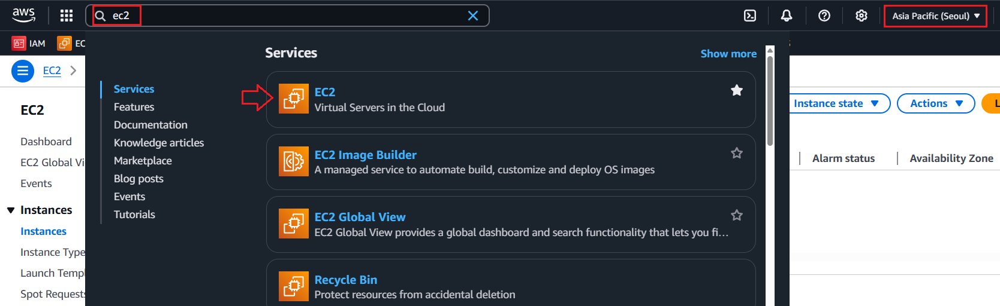

---
### 단계2: Launch instances 
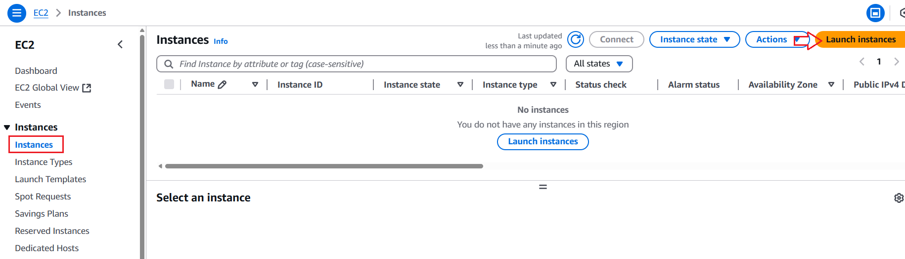

---
### 단계3: Name
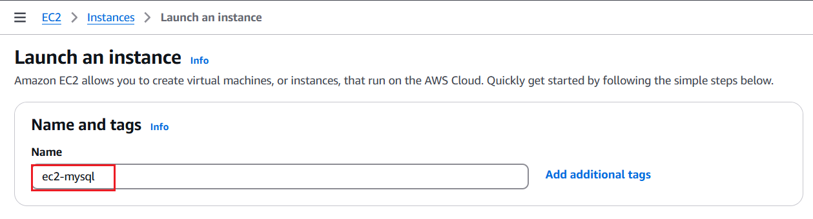

---
### 단계4: Application and OS Images (Amazon Machine Image) 
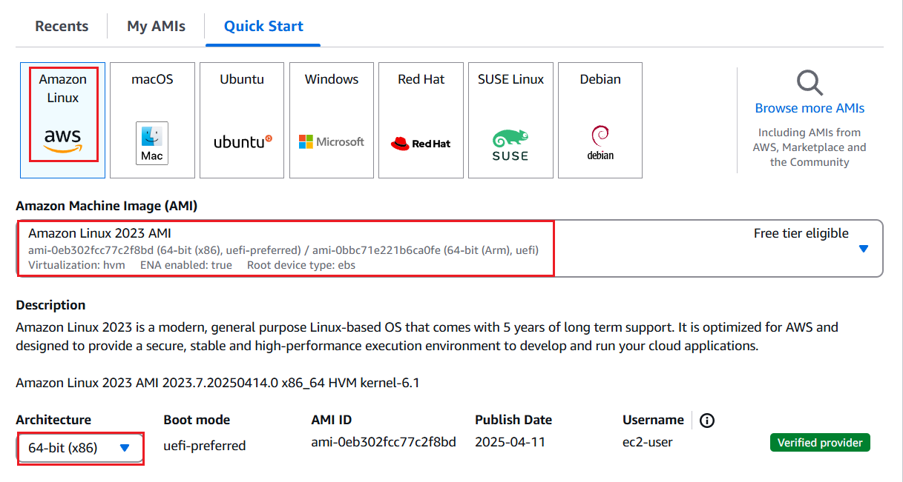

---
### 단계5: Instance type
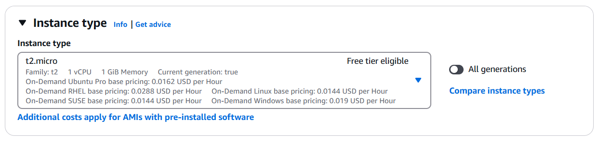

---
- [Instance type 비용](https://aws.amazon.com/ko/ec2/pricing/on-demand/)
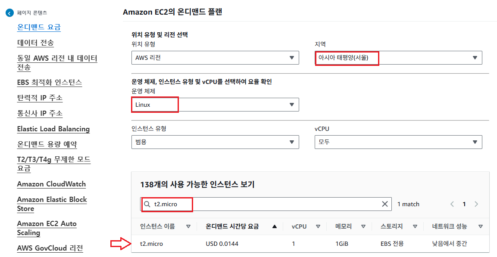

---
### 단계5: Key pair
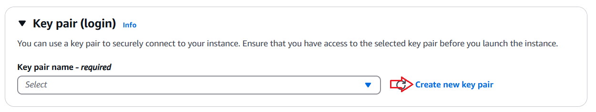

---
- Create key pair

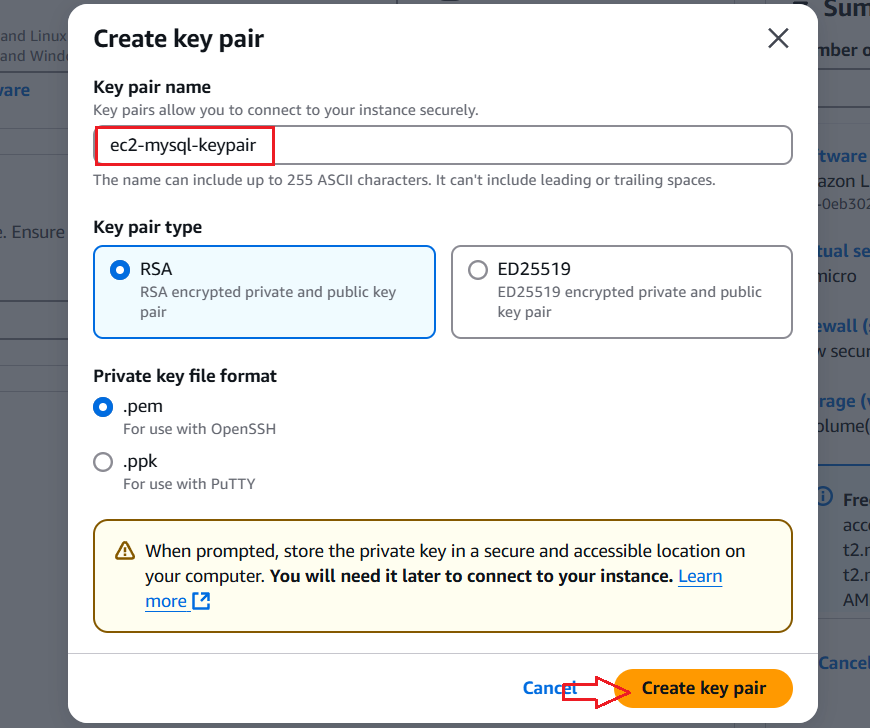

---
- pem 파일 확인 

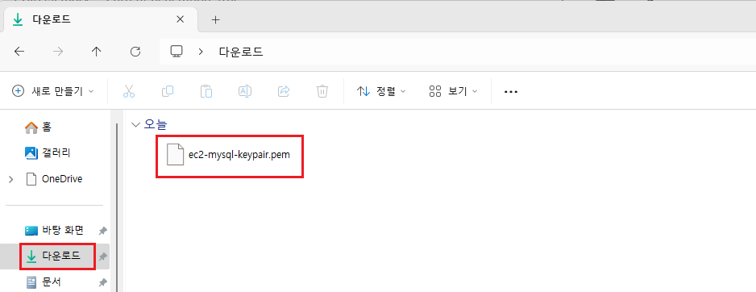

---
### 단계6: Network settings 
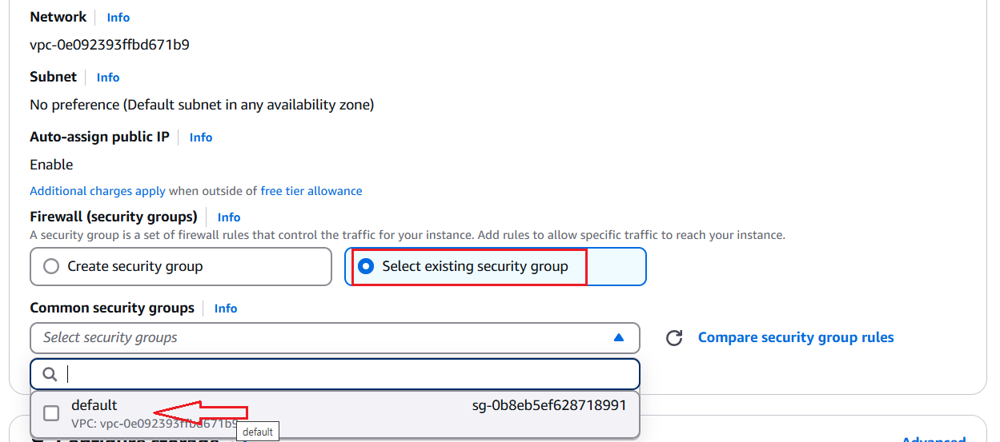

---
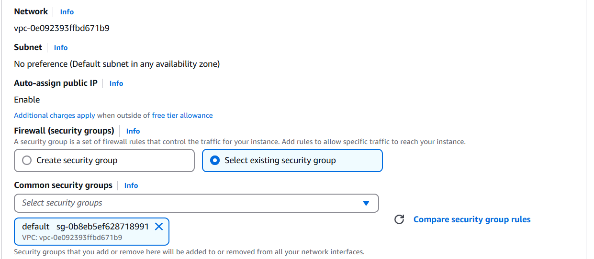

---
### 단계7: Launch instance
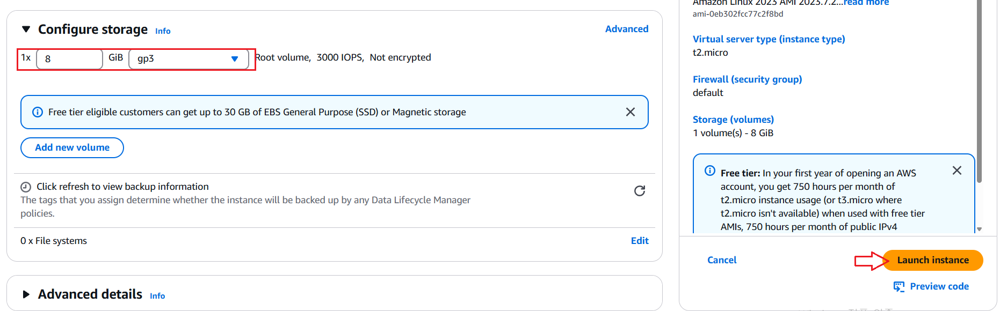

---
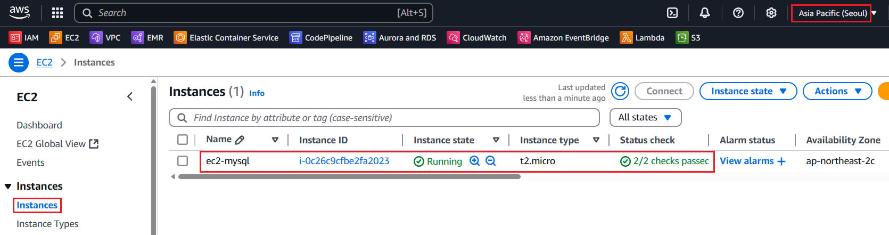

---
### 단계8: Security Groups > Inbound rules 설정 
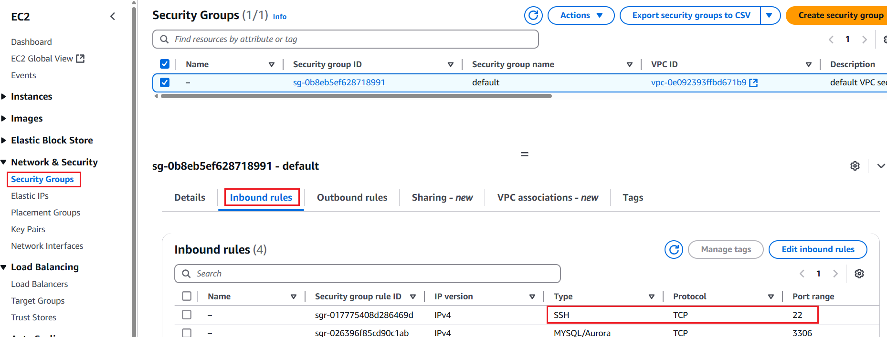

