# XSHELL 설치

---
### [단계1: XSHELL 다운로드](https://www.netsarang.com/ko/free-for-home-school/)
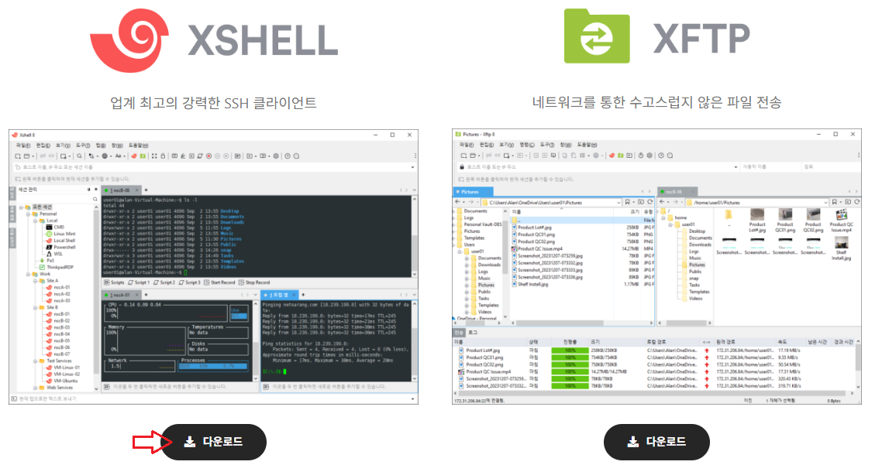

---
### 단계2: 설치
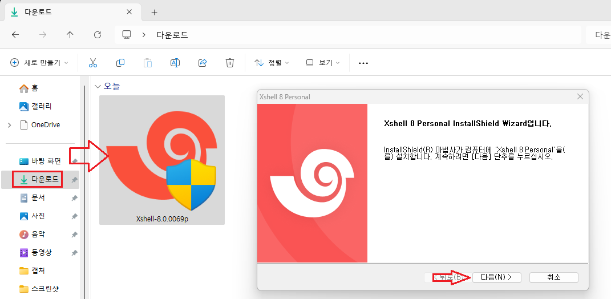

---
### [단계3: 설정](https://bart-2012.tistory.com/33)
- xshell 을 써서 서버와 연결하여 사용하던중 때때로 아래와 같은 에러로인해 연결이 끊긴다.
  - Socket error Event: 32 Error: 10053.
- 이는 컴퓨터에서 일정시간 사용을 하지 않을경우 전원 관리를 위해 네트워크 연결을 끊기 때문이다.
- 전원을 절약하기 위해 컴퓨터가 이 장치를 끌 수 있음을 이용하여 해결하자

---
- 전원을 절약하기 위해 컴퓨터가 이 장치를 끌 수 있음 > **체크해제**

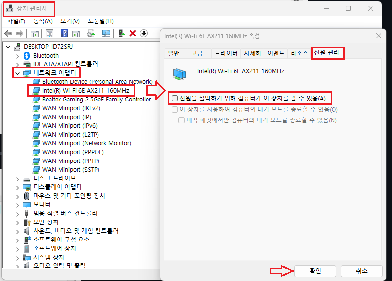

---
### 단계4: XSHELL 실행 
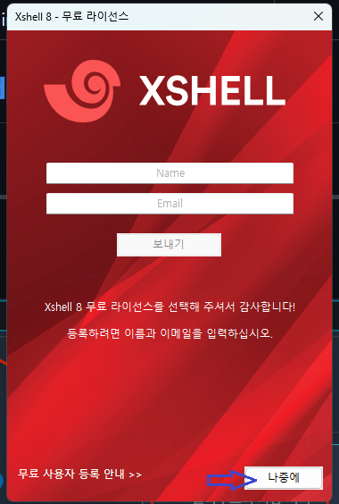

---
### 단계5: 세션 > 새로 만들기
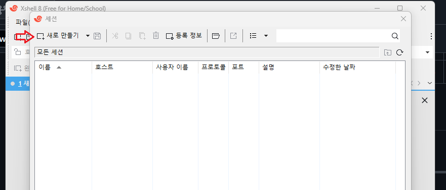

---
### 단계6: 세션 > EC2 Public IP 등록 
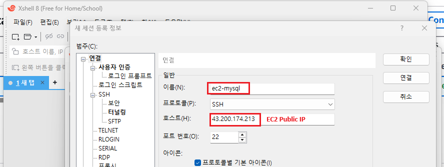

---
- EC2 Public IP 확인하는 방법

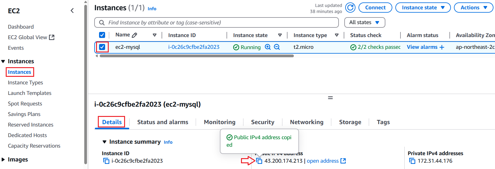

---
### 단계7: 세션 > Public Key 연결
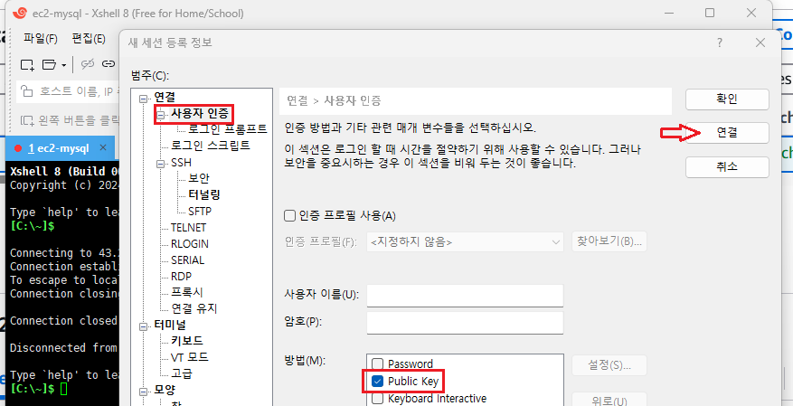

---
### 단계8: 세션 > 리눅스 사용자 이름 
- Amazon Linux의 사용자명: **ec2-user**

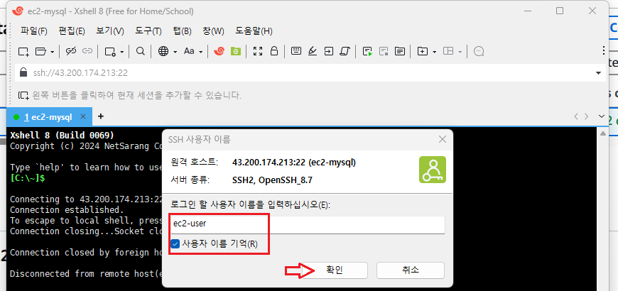

---
### 단계9: 세션 > Public Key 파일 연결
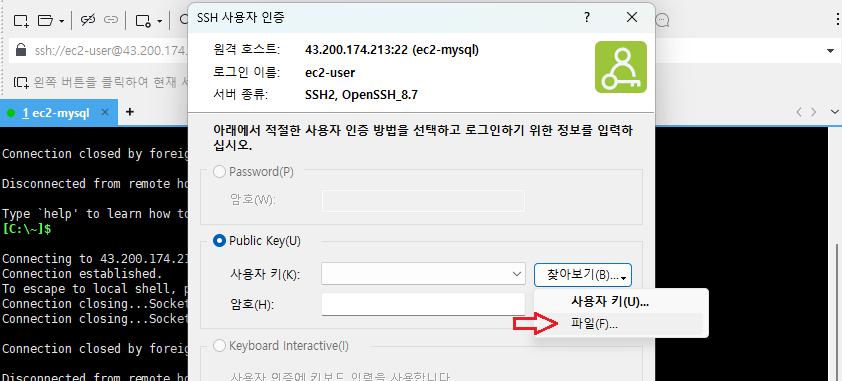

---
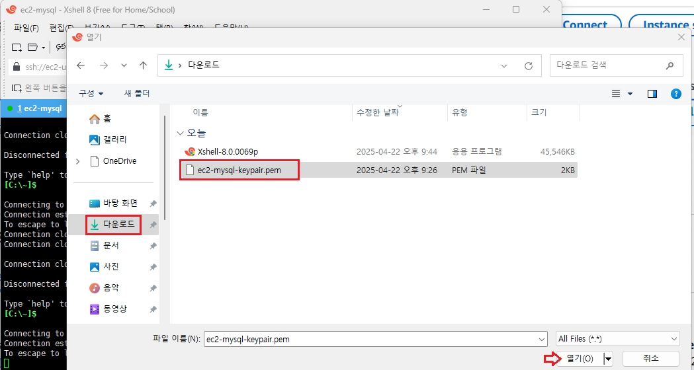

---
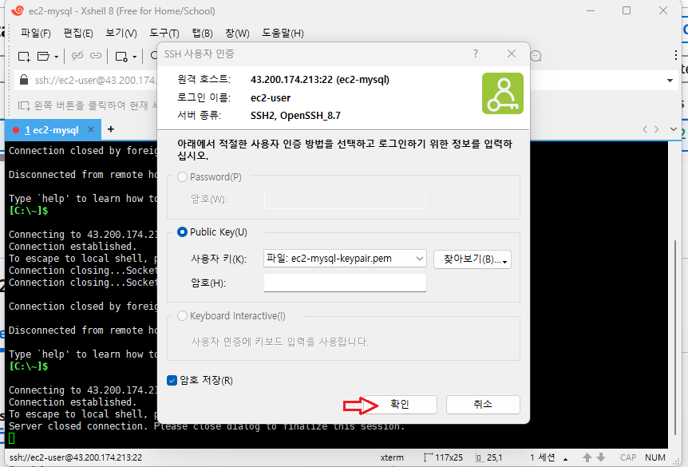

---
### 단계10: ec2 접속 
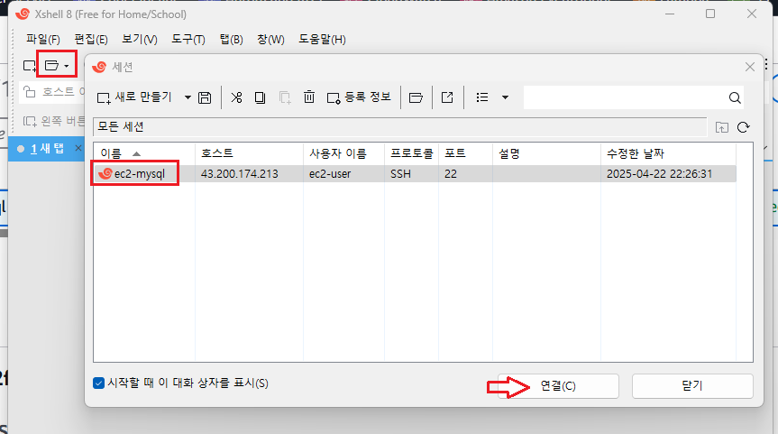

---
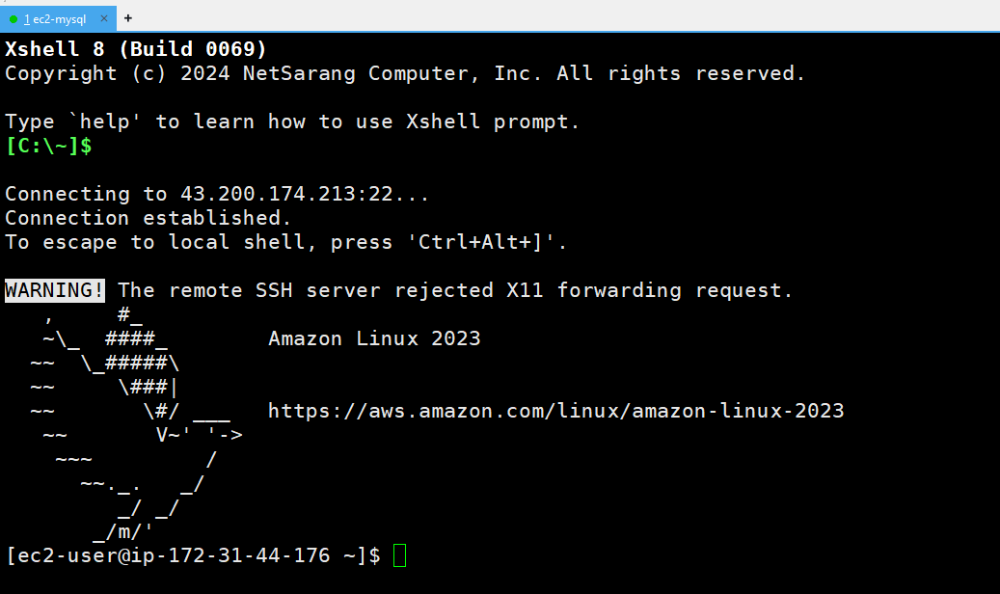

---
### 단계11: EC2 호스트 네임과 Private IP 주소가 같음 
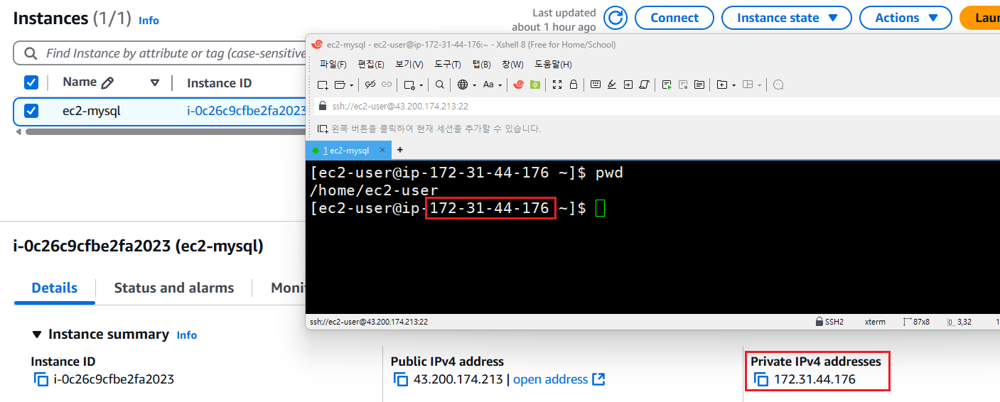

