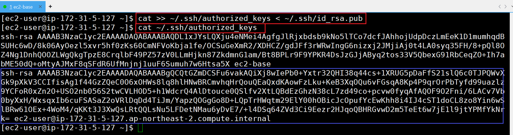

# [yum; Yellowdog Updater Modified](https://docs.redhat.com/ko/documentation/red_hat_enterprise_linux/7/html/system_administrators_guide/ch-yum#ch-yum)
- yum 은 사용 가능한 패키지에 대한 정보를 쿼리하고, 리포지토리에서 패키지를 가져와 설치 및 제거한 다음 전체 시스템을 사용 가능한 최신 버전으로 업데이트할 수 있는 Red Hat 패키지 관리자입니다. 
- yum은 패키지를 업데이트, 설치 또는 제거할 때 자동 종속성 확인을 수행하므로 사용 가능한 모든 종속 패키지를 자동으로 확인, 가져오기 및 설치할 수 있습니다.

---
### 단계1: 모든 패키지 업데이트 및 해당 종속 항목 업데이트
```shell
sudo yum update
```


---
### 단계2: 보안 관련 패키지 업데이트
```shell
sudo yum update --security
```


---
# [SSH 설정](https://blog.naver.com/joje3029/223390866901) 


---
### 단계1: ssh key 생성
```shell
# ssh key 생성
ssh-keygen -t rsa # 이후 Enter만 세 번 입력 탁! 탁! 탁!
```


---
### 단계2: ssh key 생성 확인 
```shell
ls -l ~/.ssh
```


---
### 단계3: authorized_keys에 추가
```shell
# authorized_keys에 추가
cat >> ~/.ssh/authorized_keys < ~/.ssh/id_rsa.pub
# authorized_keys 확인 
cat ~/.ssh/authorized_keys
```


---
### 단계4: authorized_keys 테스트 
```shell
# localhost 접속 테스트
ssh localhost
# Are you sure you want to continue connecting (yes/no/[fingerprint])? yes
```


---
# [Amazon Machine Image(AMI)](https://docs.aws.amazon.com/ko_kr/AWSEC2/latest/UserGuide/AMIs.html)
- Amazon Machine Image(AMI)는 Amazon EC2 인스턴스를 설정하고 부팅하는 데 필요한 소프트웨어를 제공하는 이미지입니다. 
- 또한 각 AMI에는 시작하는 인스턴스에 연결할 블록 디바이스를 지정하는 블록 디바이스 매핑이 포함되어 있습니다. 

---
### 단계1: Create Image


---


---


---
### 단계2: 생성 확인 


