# AMI를 이용하여 ec2 생성 

---
### 단계1: Launch instances 
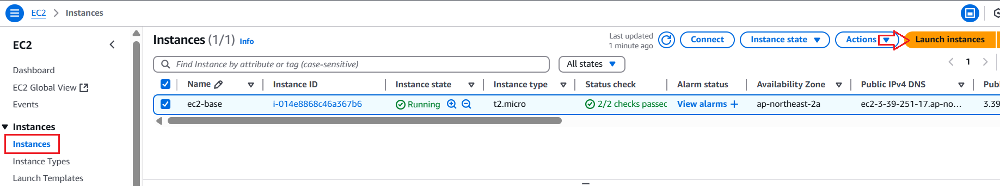

---
### 단계2: Name and tags
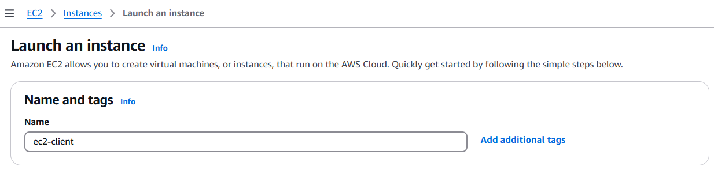

---
### 단계3: Application and OS Images (Amazon Machine Image)
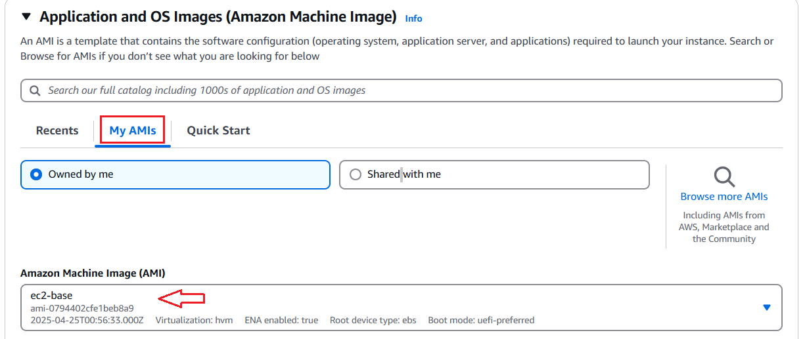

---
### 단계4: Instance type & Key pair
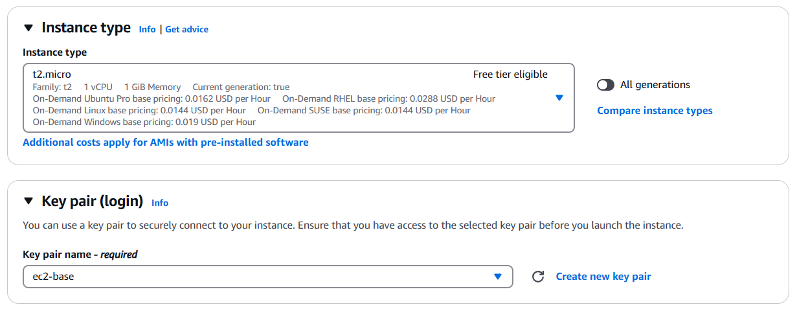

---
### 단계5: Network settings
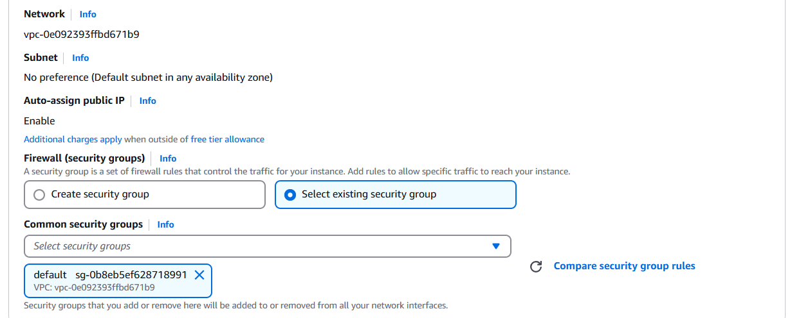

---
### 단계6: Launch instance
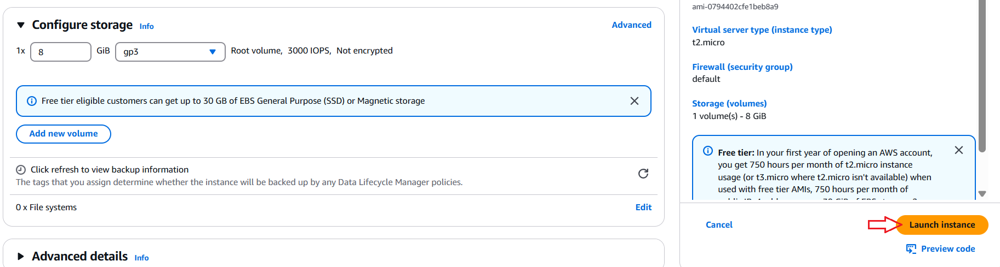

---
### 단계7: 결과 확인  
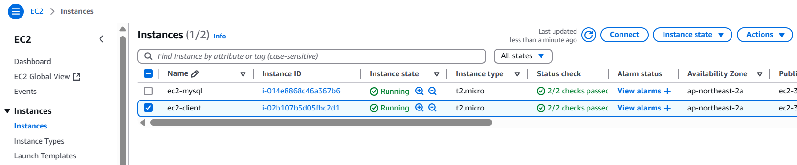

---
# SSH

---
### 단계1: Public IP 복사 
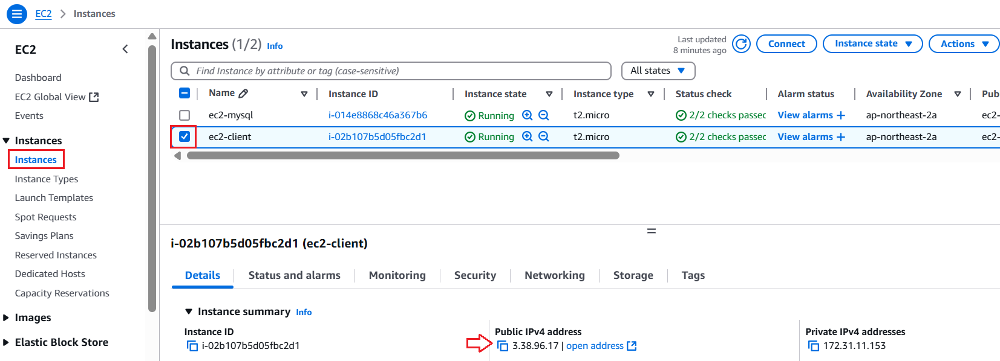

---
### 단계2: XSHELL을 이용해서 ec2 접속
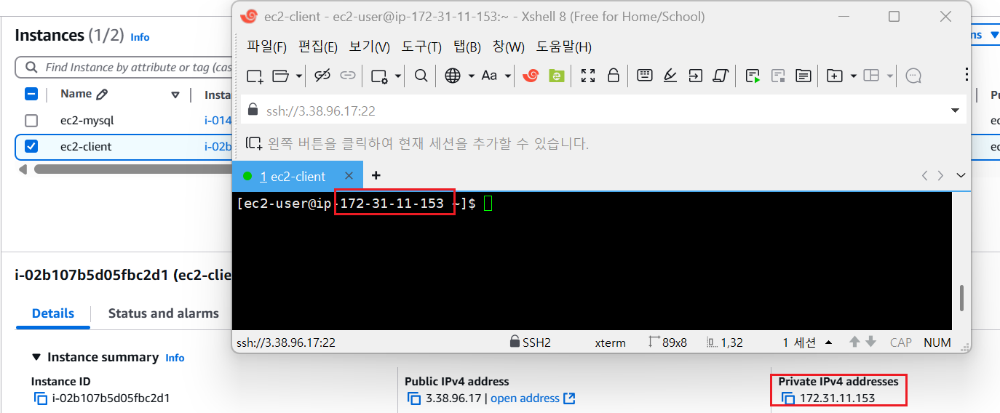

---
### 단계3: 2개 ec2 접속 
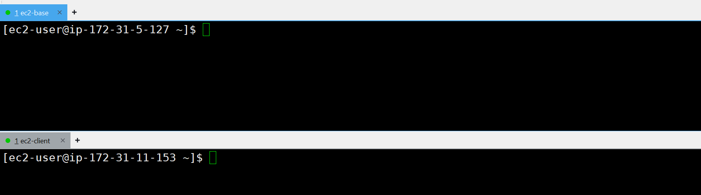

---
### 단계4: 모든 세션 적용
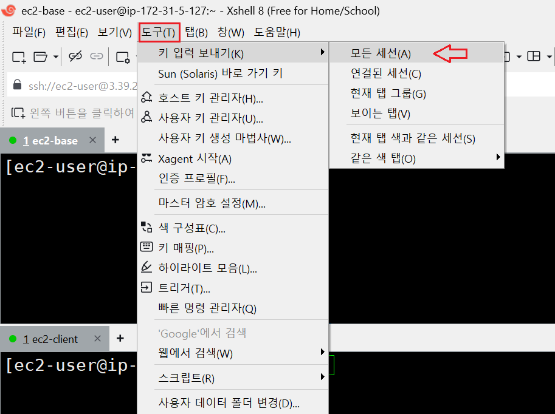

---
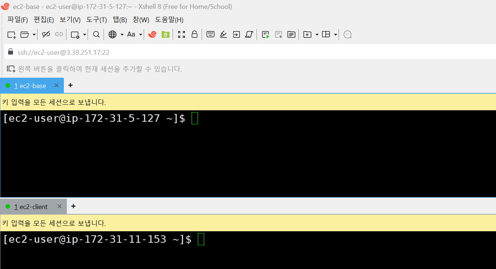

---
### 단계5: hosts 파일 편집
```shell
# hosts 파일 편집
sudo vim /etc/hosts
```
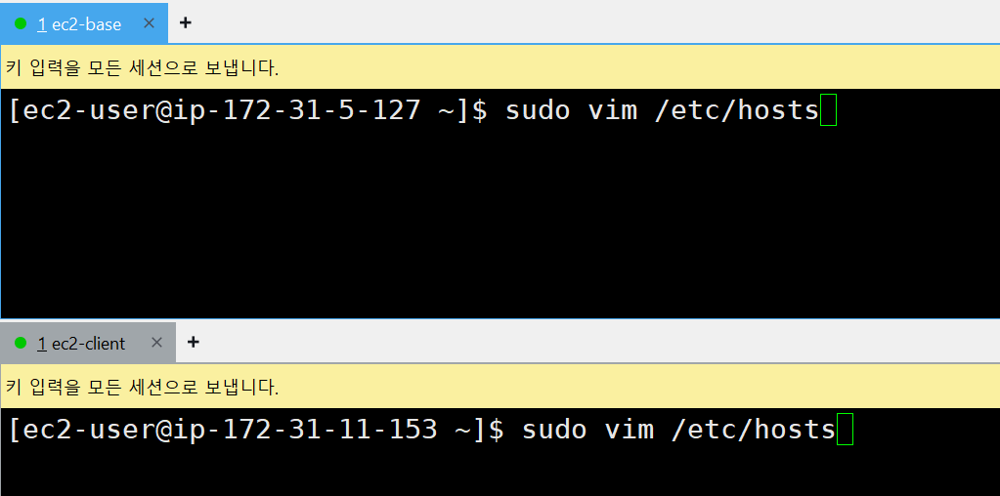

---
### 단계6: Private IP 확인 후 hosts 파일에 작성  
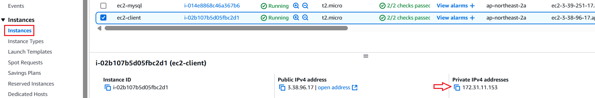

---
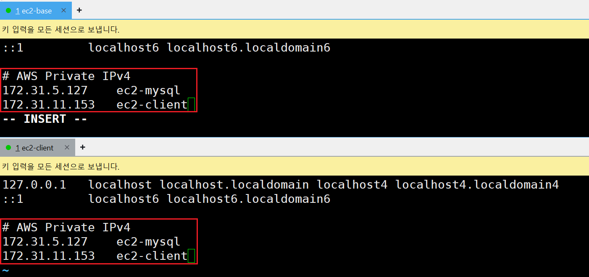

---
### 단계7: 수정된 내용 확인 
```shell
cat /etc/hosts
```
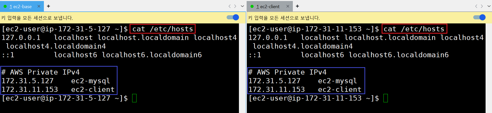

---
### 단계8: 현재 세션 
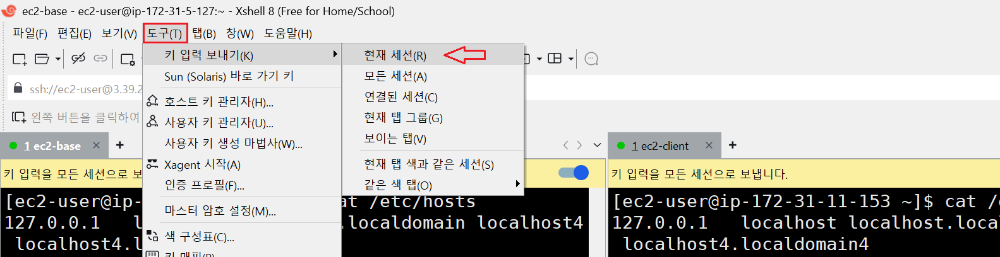

---
### 단계9: Host name 변경 > ec2-mysql  
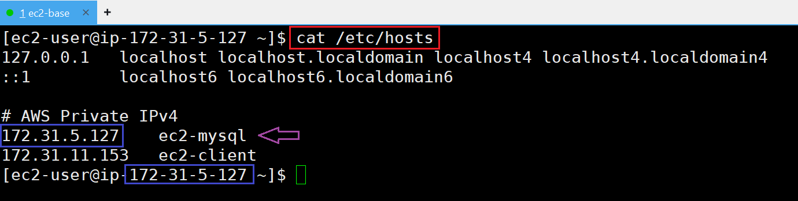

---
```shell
# host name 수정 
sudo hostnamectl set-hostname ec2-mysql
# host name 확인 
hostname
# 종료 
exit
```
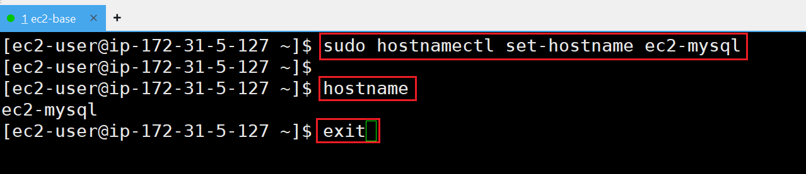

---
- 재접속 및 결과 확인 
```shell
hostname 
cat /etc/hosts
```
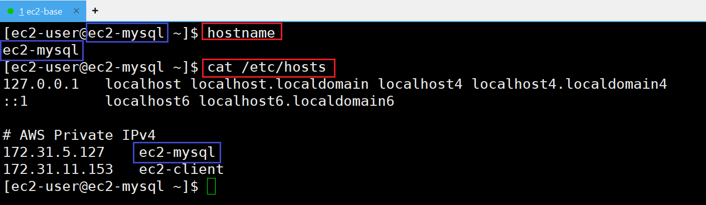

---
### 단계10: Host name 변경 > ec2-client
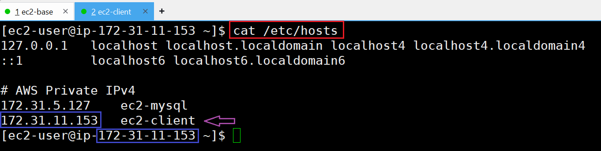 

---
```shell
# host name 수정 
sudo hostnamectl set-hostname ec2-client
# host name 확인 
hostname
# 종료 
exit
```
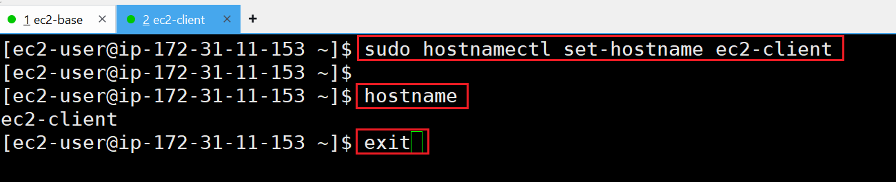

---
- 재접속 및 결과 확인 
```shell
hostname 
cat /etc/hosts
```
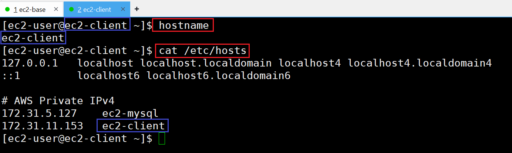

---
### 단계11: ec2-mysql에서 ec2-client 접속 
```shell
ssh ec2-client 
# Are you sure you want to continue connecting (yes/no/[fingerprint])? yes
```
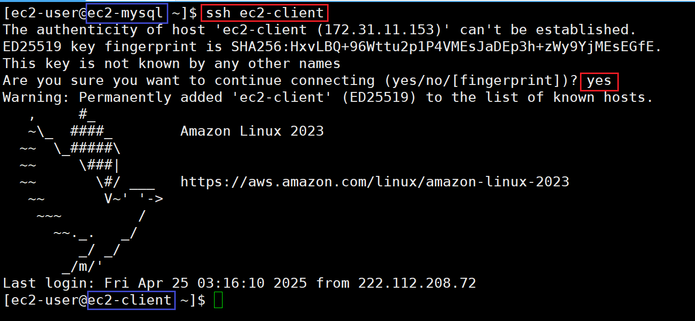

---
### 단계12: ec2-client에서 ec2-mysql 접속 
```shell
ssh ec2-mysql 
# Are you sure you want to continue connecting (yes/no/[fingerprint])? yes
```
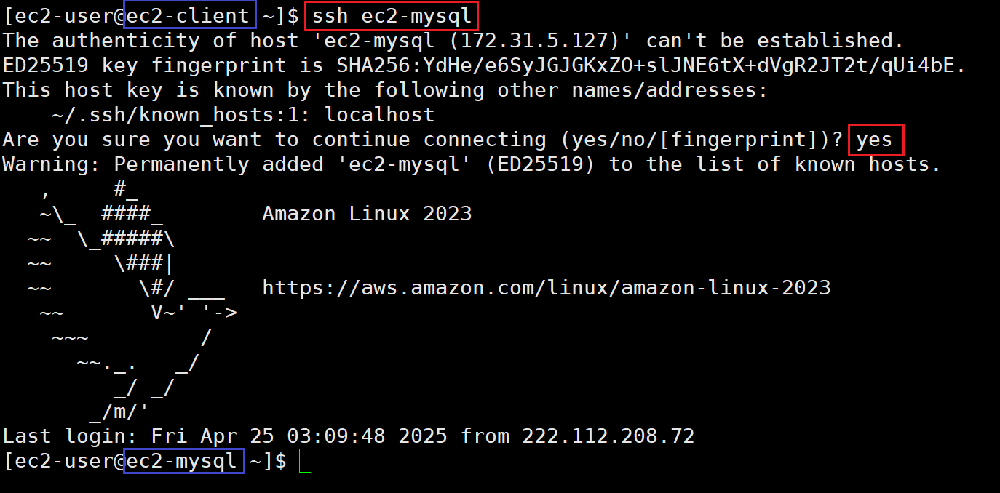
