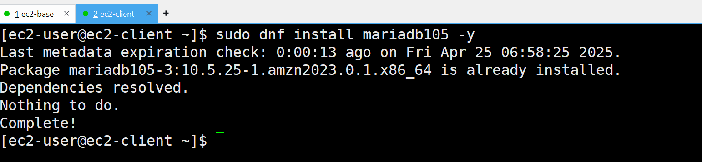
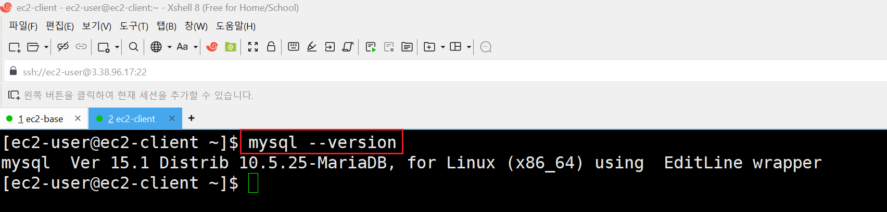
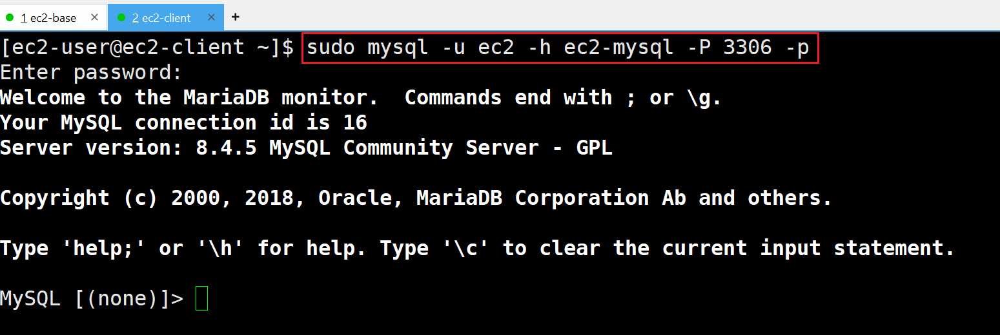
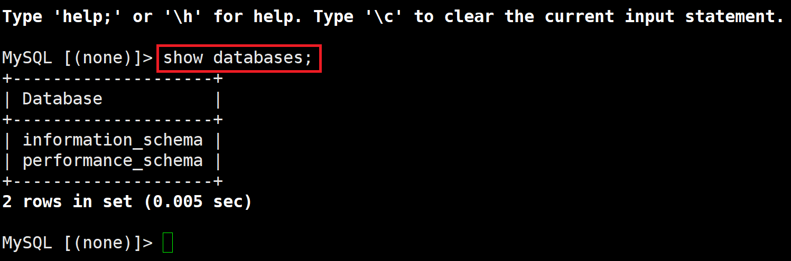

# [MySQL 클라이언트 설치](https://docs.aws.amazon.com/ko_kr/AmazonRDS/latest/UserGuide/mysql-install-cli.html)

---
### 단계1: install mariadb105
```shell
sudo dnf install mariadb105
```


---
### 단계2: 설치 확인
```shell
mysql --version
```


---
# ec2-client에서 mysql server 접속

---
### 단계1: mysql server 접속
```shell
sudo mysql -u ec2 -h ec2-mysql -P 3306 -p
```


---
### 단계2: 테스트
```sql
show databases;
```



