# [MySQL 설치](https://dev.mysql.com/doc/refman/8.4/en/linux-installation-yum-repo.html)

---
### [단계1: Adding the MySQL Yum Repository](https://dev.mysql.com/downloads/repo/yum/)
- 최신버전 복사

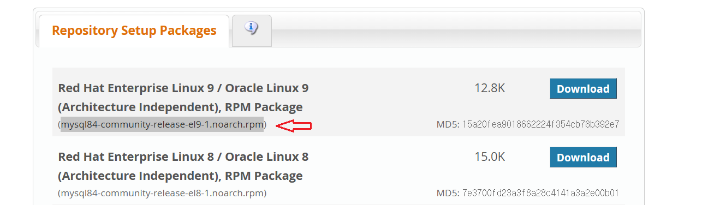

---
- 설치
```shell
# sudo yum install https://dev.mysql.com/get/{최신 버전} -y
sudo yum install https://dev.mysql.com/get/mysql84-community-release-el9-1.noarch.rpm -y
```
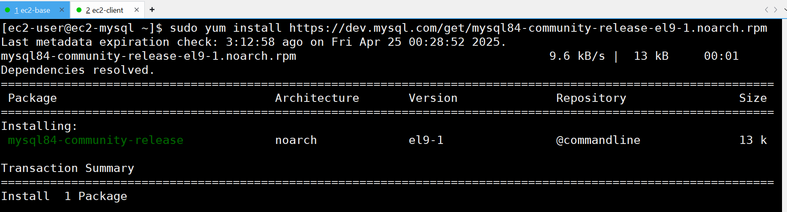

---
- 설치 결과 확인 
```shell
sudo yum repolist enabled | grep mysql.*-community
```
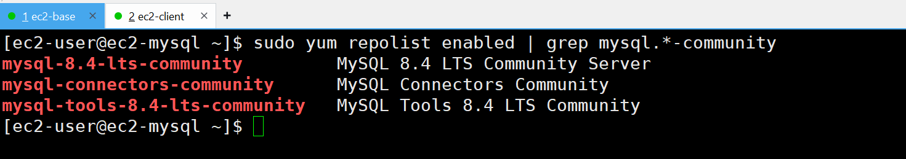

---
### 단계2: Installing MySQL
```shell
sudo yum install mysql-community-server -y
```
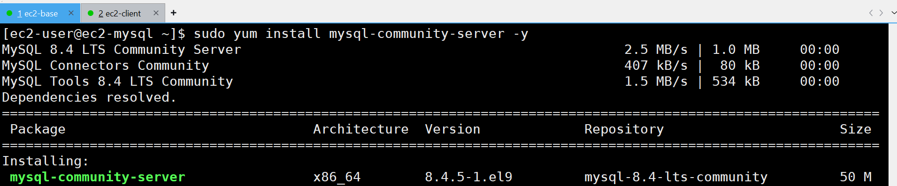

---
### 단계3: Starting the MySQL Server
```shell
# start mysql server
sudo systemctl start mysqld
sudo systemctl status mysqld
```
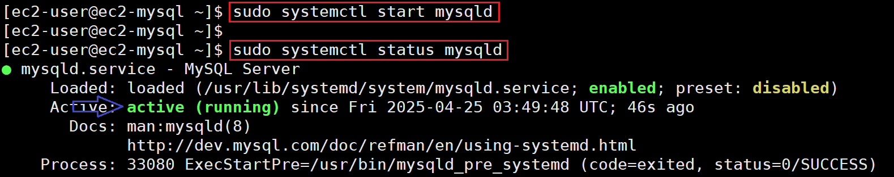

---
### 단계4: 임시 비밀번호 확인 
```shell
sudo grep 'temporary password' /var/log/mysqld.log
```
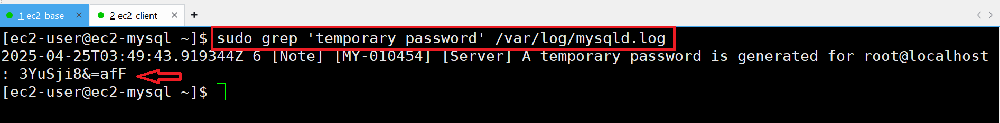

---
### 단계5: mysql server 접속 
```shell
mysql -u root -p # 임시 비밀번호 적용 
```
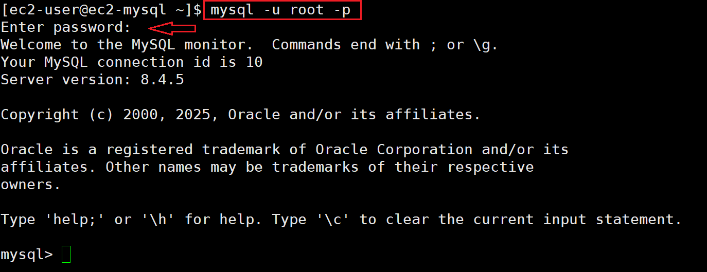

---
### 단계6: 비밀변호 변경하기 
```shell
# 비밀번호 변경하기 
ALTER user 'root'@'localhost' IDENTIFIED WITH caching_sha2_password BY 'Qwer1234!';
# 변경된 내용 적용하기 
FLUSH PRIVILEGES;
# mysql server에서 나오기 
exit
```
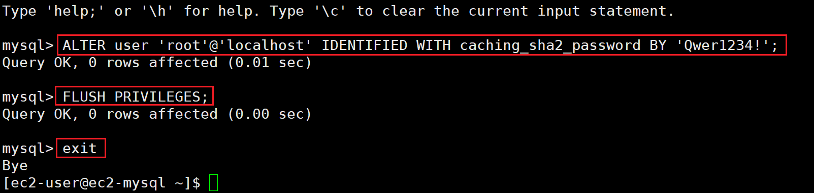

---
- 재접속 
```shell
mysql -u root -p # 변경한 비밀번호 적용 
```
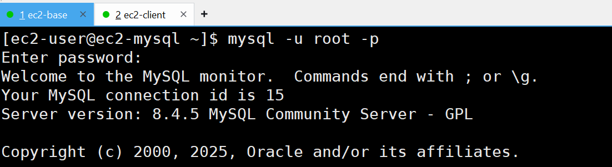

---
- sql 테스트 
```sql
show databases;
exit
```
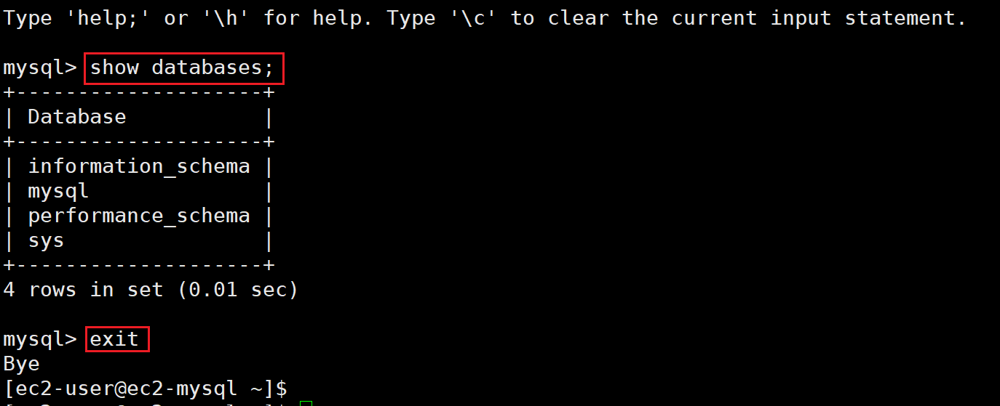

---
### 단계7: 외부아이피 허용 설정
- Ubuntu 계열: /etc/mysql/mysql.conf.d/mysqld.cnf  
- 아마존 리눅스 등 CentOS 계열: /etc/my.cnf
```shell
sudo vim /etc/my.cnf
```
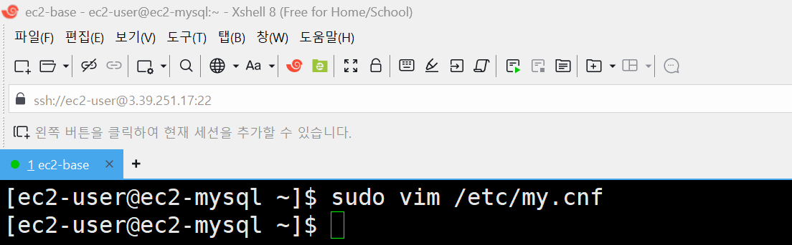

---
```shell
# 아래내용 입력 
port          = 3306
bind-address            = 0.0.0.0
mysqlx-bind-address     = 0.0.0.0
```
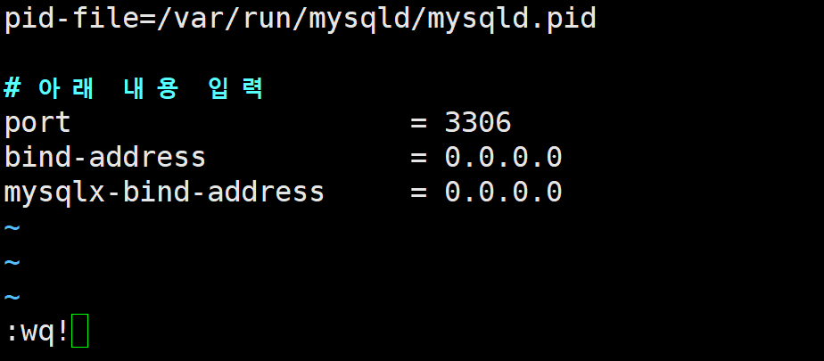

---
### 단계8: mysql server 재실행
```shell
sudo systemctl restart mysqld
sudo systemctl status mysqld
```
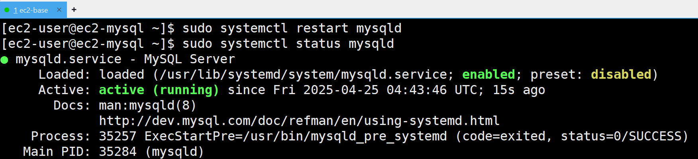

---
### 단계9: 외부아이피 허용 확인
```shell
# 외부 아이피 허용 확인 
sudo netstat -ntlp | grep mysqld
```
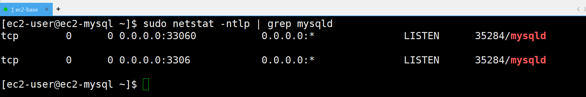

---
### 단계10: 아이피로 접속 가능한 계정 생성 
- mysql server 접속 
```shell
mysql -u root -p
```
- 계정 생성
```sql
-- 유저 생성
create user 'ec2'@'%' identified by 'Qwer1234!';
-- 유저 조회 
select user, host from mysql.user;
```

---
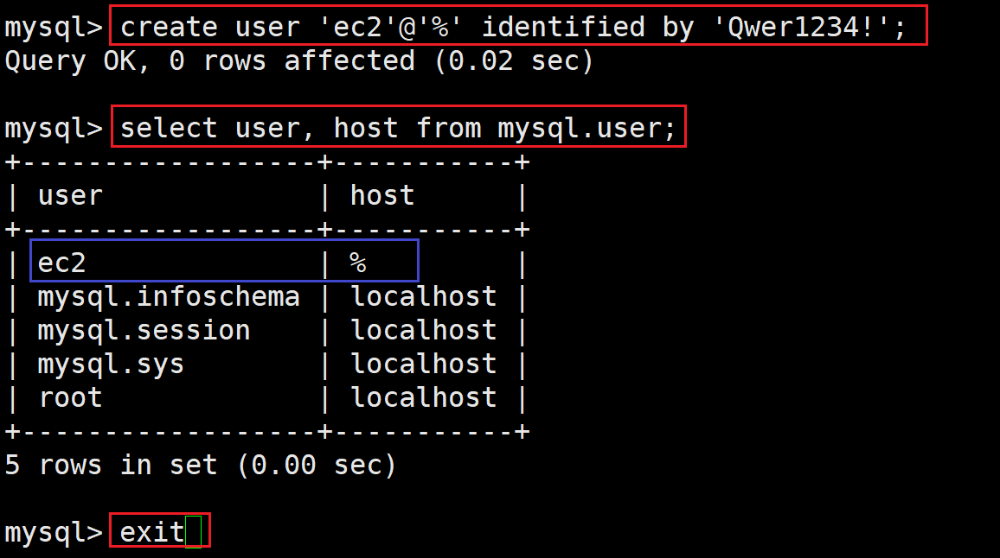

---
### 단계11: 내부 아이피 확인 
```shell
# 내부 ip 확인 
ifconfig
```
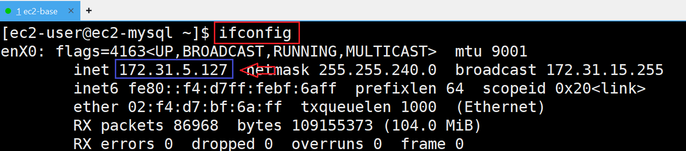

---
### 단계12: ip를 이용해서 ec2 계정으로 접속 
```shell
# 내부 ip를 이용하여 접속 
sudo mysql -u ec2 -h 172.31.5.127 -P 3306 -p
```
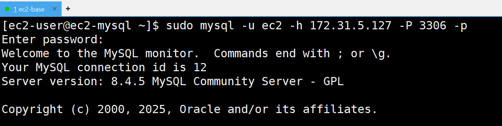

---
### 단계12: hostname을 이용해서 ec2 계정으로 접속 
```shell
# 내부 ip를 이용하여 접속 
sudo mysql -u ec2 -h ec2-mysql -P 3306 -p
```
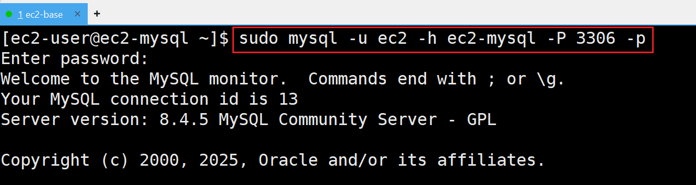

---
### 단계13: 테스트 
```sql
show databases;
```
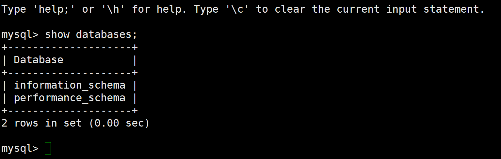