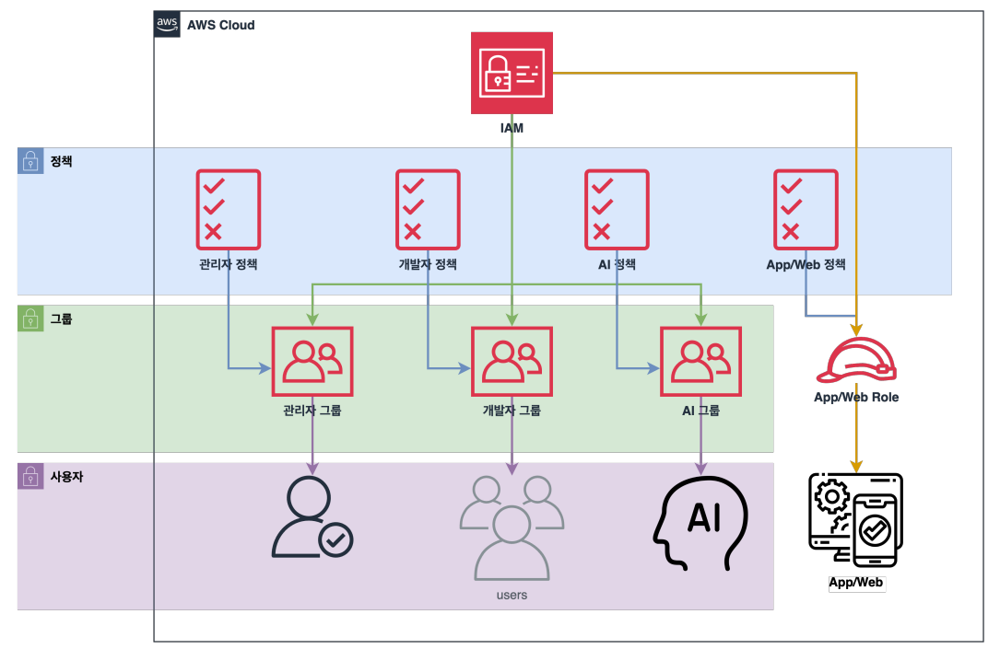
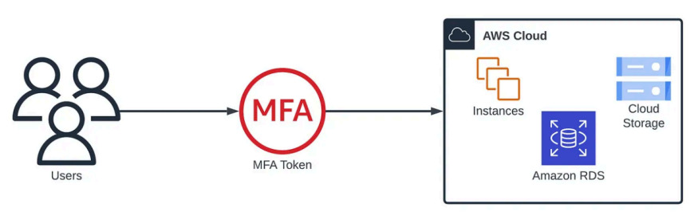
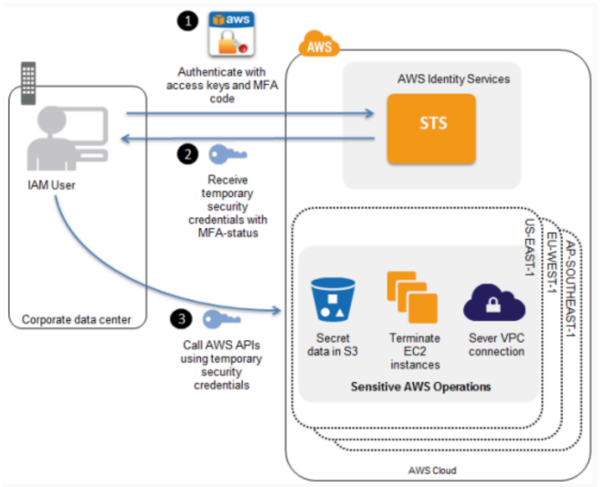
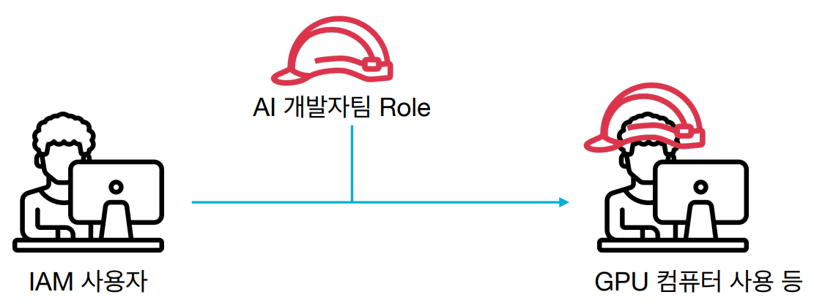
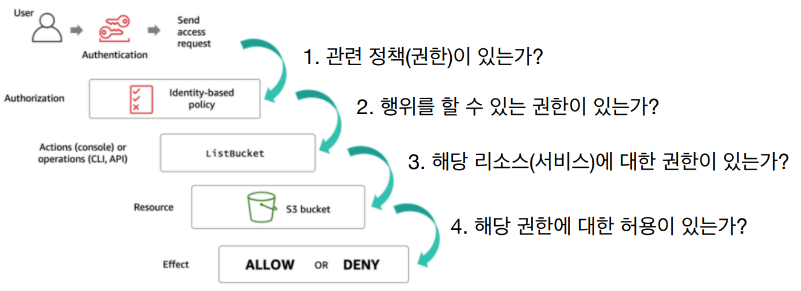

# [IAM(IdentityandAccessManagement)](https://aws.amazon.com/ko/iam/)
- AWS의 보안 및 관리를 담당하는 글로벌 서비스
- 주요 기능
  - AWS 어카운트 관리 및 리소스/사용자/서비스의 권한 제어
  - 사용자의 생성/관리/계정의 보안

---
## IAM 구성 
- 사용자
  - 실제 AWS를 사용하는 사람 또는 어플리케이션
- 그룹
  - 사용자의 집합
  - 그룹에 속한 사용자의 그룹에 부여된 권한을 행사
- 역할(Role)
  - AWS의 권한의 집합
  - IAM 사용자 또는 어플리케이션에 역할을 부여하여 사용
- 정책(Policy)
  - 사용자와 그룹, 역할이 무엇을 할 수 있는지에 대한 권한을 정의한 문서

---


---
### [IAM 구성 > Root 사용자](https://docs.aws.amazon.com/ko_kr/IAM/latest/UserGuide/id_root-user.html)
- Root 사용자
  - 계정을 생성할 때 같이 생성되는 사용자
  - **계정의 모든 권한을 가지고 있으며 계정 권한을 제한할 방법이 없음**
- Root 사용자만 가능한 작업
  - AWS 계정 설정 변경(이메일 주소, 연락처 등)
  - **AWS 계정 설정 변경이 외에는 Root 사용자 사용을 지양해야 함**

---
### [IAM 구성 > IAM 사용자](https://docs.aws.amazon.com/ko_kr/IAM/latest/UserGuide/id_users.html)
- IAM(Identity and Access Management)을 통해 생성한 사용자
- AWS 서비스 사용 및 관리의 목적으로 사용하는 사용자
- **생성 시 권한이 따로 부여되어 있지 않기 때문에 정책 혹은 그룹을 통해 권한을 부여**

---
### MFA(다중인증)이란?
- 누군가가 자기 자신이라고 주장하는 사람이 정말 그 당사자인지 어떻게 알 수 있을까요?
  - **인증**은 바로 그 질문에 대한 답을 찾는 과정입니다.
- MFA는 웹사이트, 애플리케이션 또는 시스템을 사용하기 위해 둘 이상의 고유한 인증 요소가 필요한 인증 방식입니다.
  - **인증 요소**는 사용자가 특정 리소스에 액세스하려고 할 때, 사용자의 신원을 확인하는 보안자격 증명입니다.

---


---
### [AWS 사용자 > MFA](https://aws.amazon.com/ko/iam/features/mfa/)
- 다중 인증(MFA)은 사용자에게 암호 이외의 추가 정보를 입력하도록 요구하는 다중 단계 계정 로그인 과정입니다.
- Root 사용자 & IAM 사용자 계정에는 모두 MFA를 적용하는 것을 지향해야 합니다.



---
### [IAM 구성 > 역할(Role)](https://docs.aws.amazon.com/ko_kr/IAM/latest/UserGuide/id_roles.html)
- AWS의 권한의 집합
- IAM 사용자 또는 어플리케이션에 역할을 부여하여 사용



---
### [IAM 구성 > 정책(Policy)](https://docs.aws.amazon.com/ko_kr/IAM/latest/UserGuide/access_policies.html)
- 사용자와 그룹, 역할이 무엇을 할 수 있는지에 대한 권한을 정의한 문서
- 구성
  - **Resource**: AWS 리소스(서비스)
  - **Action**: AWS 리소스에 대한 행동(생성/수정/변경/삭제/조회)
  - **Effect**: 허용/거부
  - **Condition**: 정책이 적용되는 조건(예: IP, 태그 등)

---
- 다음 자격 증명 기반 정책은 `amzn-s3-demo-bucket`이라는 하나의 `Amazon S3 버킷 목록`에 암시된 보안 주체를 허용합니다.

```json
{
  "Version": "2012-10-17",
  "Statement": {
    "Effect": "Allow",
    "Action": "s3:ListBucket",
    "Resource": "arn:aws:s3:::amzn-s3-demo-bucket"
  }
}
```

---
- 이 정책에서는 `특정 AWS 계정 구성원(account-id)`이 amzn-s3-demo-bucket라는 버킷의 모든 Amazon S3 작업을 수행할 수 있도록 합니다. 

```json
{
  "Version": "2012-10-17",
  "Statement": [{
    "Sid": "1",
    "Effect": "Allow",
    "Principal": {"AWS": ["arn:aws:iam::account-id:root"]},
    "Action": "s3:*",
    "Resource": [
      "arn:aws:s3:::amzn-s3-demo-bucket",
      "arn:aws:s3:::amzn-s3-demo-bucket/*"
    ]
  }]
}
```

---
- 정책(권한) 검증 과정



