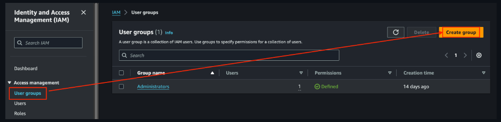

# [AWS Admin 계정 만들기](https://docs.aws.amazon.com/ko_kr/streams/latest/dev/setting-up.html)
- AWS에 처음 가입한 이메일로 로그인하면 **루트 사용자**입니다.
- **루트 사용자**는 AWS의 요금/정산 등 중요한 리소스에 접근이 가능한 계정이다.

따라서 AWS에서 제공하는 리소스를 사용(개발)하는 경우에는 IAM 사용자를 만들어서 계정별 권한을 부여하여 사용해야 한다.

---
### 단계1: IAM 접속

---
### 단계2: User groups 생성

---
- User groups 설정

---
- Policies 정의

---
### 단계3: Users 생성

---
- Specify user details

---
- Set permissions

---
- Review and create

---
- Retrieve password

---
### 단계4: 콘솔 로그인

---
- 새 비밀번호 생성

---
### 단계5: [사용 가능한 MFA 앱 설치](https://docs.aws.amazon.com/ko_kr/singlesignon/latest/userguide/mfa-types.html#mfa-types-apps)

---
### 단계6: [MFA devices 설정](https://docs.aws.amazon.com/ko_kr/singlesignon/latest/userguide/mfa-types.html#mfa-types-apps?icmpid=docs_sso_user_portal)

---

---

---
- MFA 앱 적용

