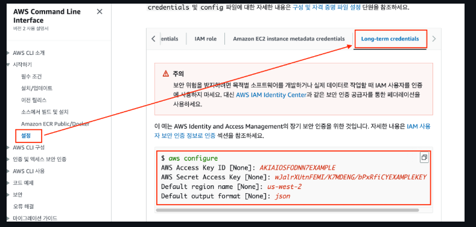

# [AWS Command Line Interface](https://docs.aws.amazon.com/ko_kr/streams/latest/dev/setup-awscli.html)
- AWS Command Line Interface(AWS CLI)는 AWS 서비스를 관리하는 통합 도구입니다. 
- 도구 하나만 다운로드하여 구성하면 여러 AWS 서비스를 명령줄에서 제어하고 스크립트를 통해 자동화할 수 있습니다.

---
### [단계1: AWS CLI 설치](https://docs.aws.amazon.com/cli/latest/userguide/getting-started-install.html)
- [맥북인 경우 root 계정으로 변경 후 진행](https://heeestorys.tistory.com/877)


---
- AWS CLI 설치 확인 
```shell
aws --version
```


---
### 단계2: AWS IAM User 선택


---
### 단계3: Access Key 생성


---


---


---
### [단계4: AWS configure에 적용](https://docs.aws.amazon.com/ko_kr/cli/latest/userguide/getting-started-quickstart.html)


---
- Window에 적용 
```shell
$ aws configure
AWS Access Key ID [None]: ********************(아이디 입력)
AWS Secret Access Key [None]: ********************(비번 입력)
Default region name [None]: ap-northeast-2
Default output format [None]: json
```


---
### 단계5: VS Code에서 확인
- AWS 익스텐션 설치


---
- AWS config 설정 확인


---


---
### [단계6: AWS CLI 테스트](https://docs.aws.amazon.com/ko_kr/cli/latest/userguide/cli-chap-code-examples.html)


---
```shell
$ aws s3 ls # 생성된 s3 버킷 조회 
$ aws s3 mb s3://s3이름 # s3이름 >> 해당 이름으로 s3 버킷 생성  
$ aws s3 ls # 생성된 s3 버킷 조회 
```


