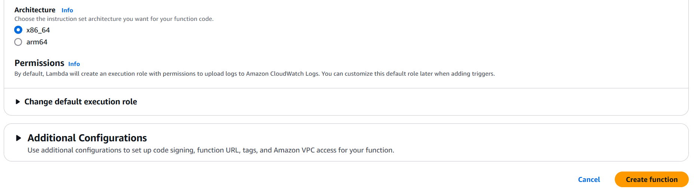

# Lambda 생성하기 

---
### 단계1: AWS Lambda 이동 


---
### 단계2: AWS Lambda 생성


---


---


---
### 단계3: AWS Lambda 생성 확인 및 선택


---
# Lambda Configuration

---
### General configuration


---
### Execution role


---
# Lambda 테스트 

---
### 단계1: 코드 수정 


---
```shell
import json

def lambda_handler(event, context):
    # TODO implement
    print("Hello World")
    return {
        'statusCode': 200,
        'body': json.dumps(event)
    }

```

---
### 단계2: Deploy


---
### 단계3: Test 이동 


---
### 단계4: Test Event 저장(생성)


---
### 단계5: Test 진행 


---
- 결과 확인 


