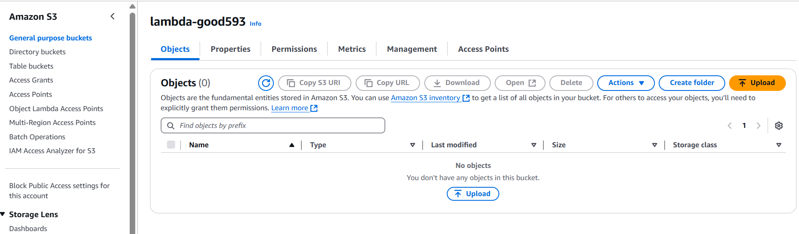
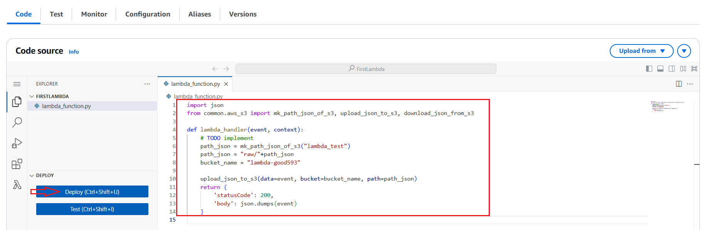

# Layer 생성하기 

---
## [Amazon S3](https://aws.amazon.com/ko/s3/)
- Amazon Simple Storage Service(S3)는 업계 최고 수준의 확장성, 데이터 가용성, 보안 및 성능을 제공하는 객체 스토리지 서비스입니다. 
- 규모와 업종에 관계없이 수백만 명의 고객이 데이터 레이크, 클라우드 네이티브 애플리케이션, 모바일 앱 등 거의 모든 사용 사례에서 모든 양의 데이터를 저장, 관리, 분석, 보호하고 있습니다.

---
### 단계1: S3 접속


---
### 단계2: Create bucket


---
- Bucket name은 Global하게 유일해야함 


---
- Bucket 생성하기 


---
- 생성 확인 


---


---
## [AWS SDK for Python(Boto3)](https://aws.amazon.com/ko/sdk-for-python/)
- Boto3를 사용하면 Python 애플리케이션, 라이브러리 또는 스크립트를 Amazon S3, Amazon EC2, Amazon DynamoDB 등 AWS 서비스와 쉽게 통합할 수 있습니다.

---
### [Boto3 API 문서](https://boto3.amazonaws.com/v1/documentation/api/latest/guide/resources.html)
Boto3에는 뚜렷이 구별되는 두 가지 수준의 API가 있습니다. 
- Client(또는"낮은 수준") API는 기본 HTTP API 작업에 일대일 매핑을 제공합니다. 
- Resource(리소스) API 명시적인 네트워크 호출을 숨기지만 대신 속성에 액세스하고 작업을 수행하도록 리소스 객체 및 리소스 모음을 제공합니다.

---
- [Client 공식 문서](https://boto3.amazonaws.com/v1/documentation/api/latest/reference/services/s3.html#s3)
```python
import boto3

client = boto3.client('s3')
```

- [Resource 공식 문서](https://boto3.amazonaws.com/v1/documentation/api/latest/guide/migrations3.html)
```python
import boto3

s3 = boto3.resource('s3')
```

---
### 단계1: python 폴더 압축하기 


---
### 단계2: AWS Lambda Layer 생성 


---
- 압축파일 업로드


---
- Create


---
- 결과 확인 


---
# Lambda with Layer

---
### 단계1: Lambda 선택 


---
### 단계2: Add Layder


---


---


---
# Permissions 수정

---
### 단계1: IAM Role 접속 


---
### 단계2: Attach policies


---
### 단계3: add AmazonS3FullAccess


---


---
# 테스트 

---
### 단계1: 코드 수정 
```python
import json
from common.aws_s3 import mk_path_json_of_s3, upload_json_to_s3, download_json_from_s3

def lambda_handler(event, context):
    # TODO implement
    path_json = mk_path_json_of_s3("lambda_test")
    path_json = "raw/"+path_json
    bucket_name = "생성한 bucket명"

    upload_json_to_s3(data=event, bucket=bucket_name, path=path_json)
    return {
        'statusCode': 200,
        'body': json.dumps(event)
    }

```

---
### 단계2: Deploy


---
### 단계3: Test


---
### 단계4: 파일 확인 in S3


---


