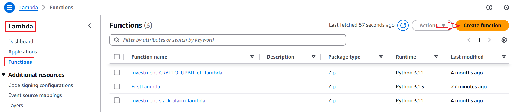
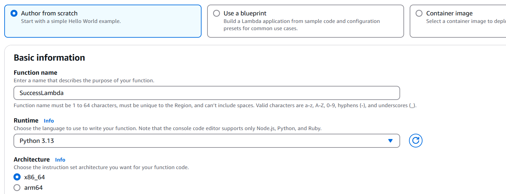
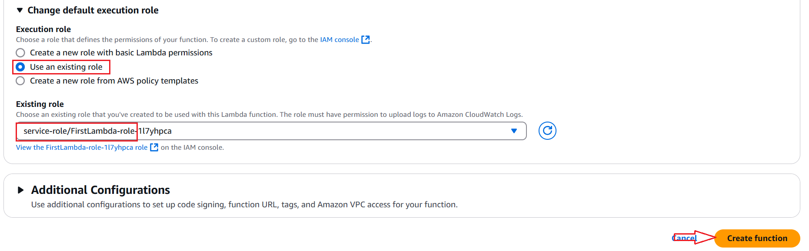
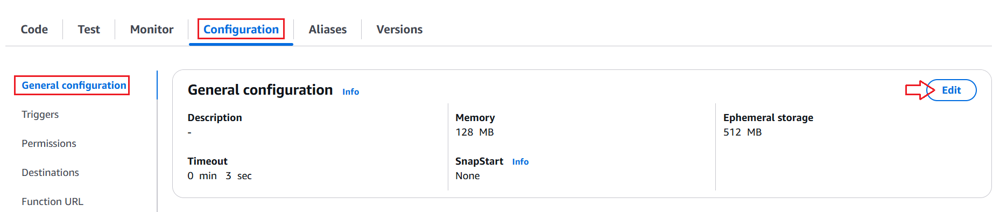
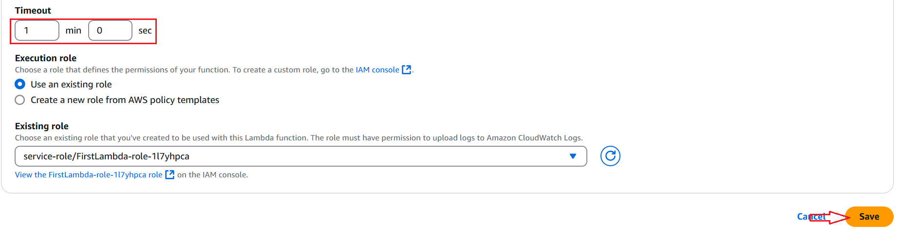
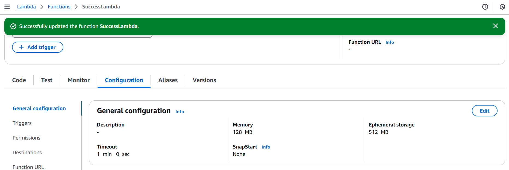
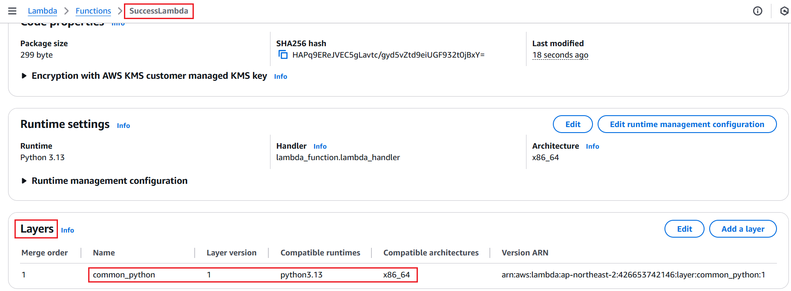
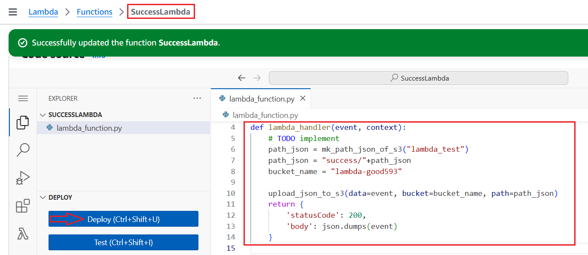

# SuccessLambda 생성 

---
### 단계1: Create function


---


---


---
### 단계2: configuration > Timeout 수정 


---


---


---
### 단계3: Layer 추가 


---
### 단계4: 코드 수정 
```python
import json
from common.aws_s3 import mk_path_json_of_s3, upload_json_to_s3, download_json_from_s3

def lambda_handler(event, context):
    # TODO implement
    path_json = mk_path_json_of_s3("lambda_test")
    path_json = "success/"+path_json
    bucket_name = "lambda-good593"

    upload_json_to_s3(data=event, bucket=bucket_name, path=path_json)
    return {
        'statusCode': 200,
        'body': json.dumps(event)
    }

```
---
### 단계5: Deploy

