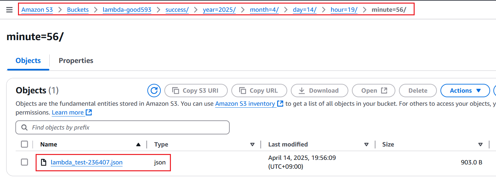

# Trigger

---
### 단계1: add trigger

---
### 단계2: Trigger configuration

---

---

---

---
### 단계3: S3 > Properties

---
### 단계4: S3 > Properties > Event notification 확인 

---
# Test

---
### 단계1: FirstLambda > Test

---
### 단계2: S3 > 확인 
- 1~2분 정도 기다림

---

