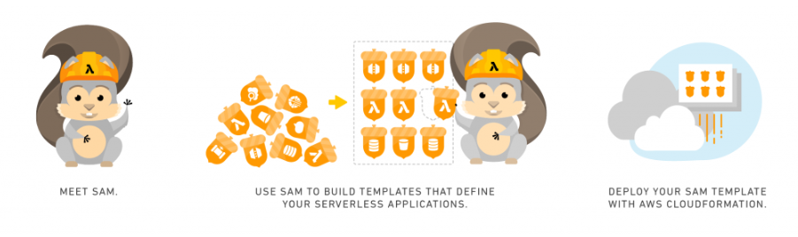
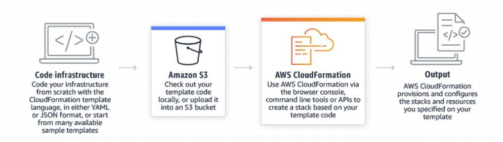
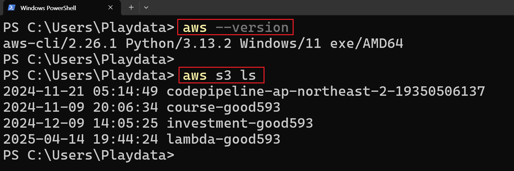
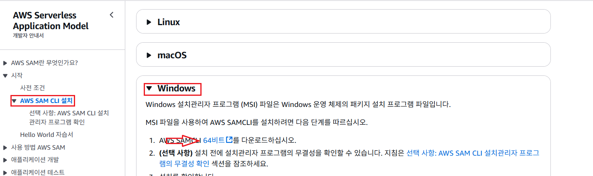
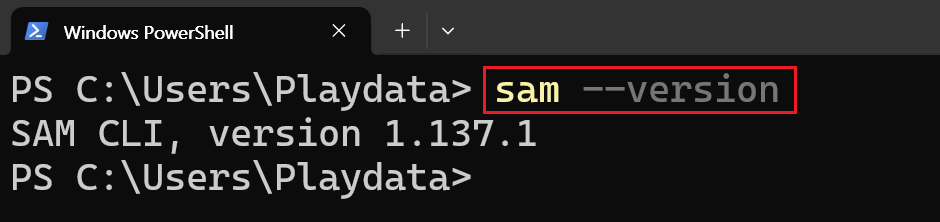
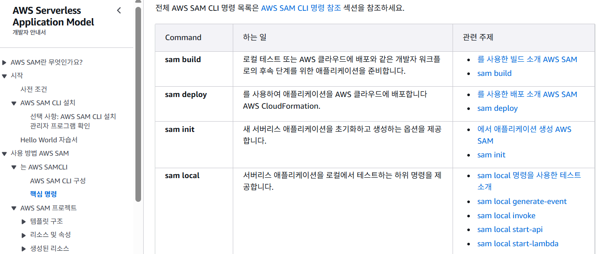
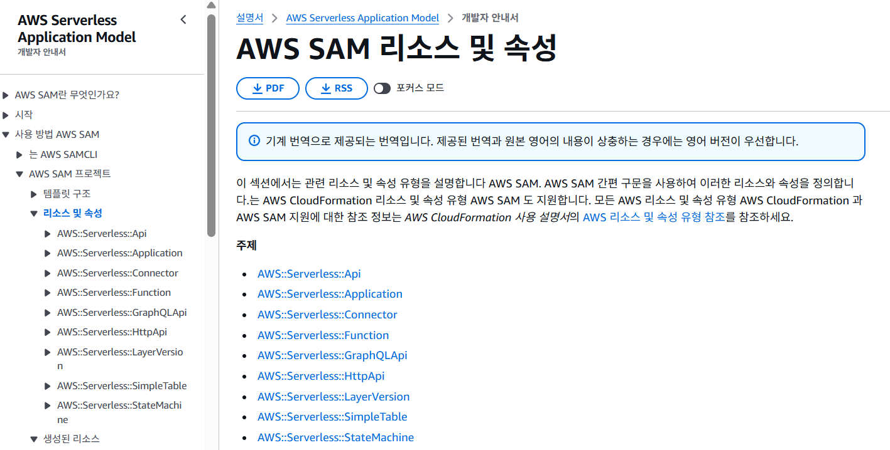

# [AWS Serverless Application Model](https://aws.amazon.com/ko/serverless/sam/)
- AWS Serverless Application Model(AWS SAM)은 AWS SAM 템플릿과 AWS Serverless Application Model 명령줄 인터페이스(AWS SAM CLI)의 두 부분으로 구성됩니다. 
- **AWS SAM 템플릿** 은 서버리스 애플리케이션을 위한 코드형 인프라(IaC)를 정의하는 데 최적화된 간편 구문을 제공합니다.
- **AWS CloudFormation** 의 확장 기능인 AWS SAM 템플릿을 CloudFormation에 직접 배포하여 AWS에서 제공하는 광범위한 IaC 지원을 활용할 수 있습니다.



---
## [AWS CloudFormation이란?](https://aws.amazon.com/ko/cloudformation/)
- AWS CloudFormation을 사용하면 인프라를 코드로 처리하여 AWS 및 서드 파티 리소스를 모델링, 프로비저닝 및 관리할 수 있습니다.



---
## [Install](https://docs.aws.amazon.com/ko_kr/serverless-application-model/latest/developerguide/serverless-getting-started.html)

### [1. 사전작업](https://docs.aws.amazon.com/ko_kr/serverless-application-model/latest/developerguide/prerequisites.html)
[1-1. 단계: AWS 계정 가입](https://docs.aws.amazon.com/ko_kr/serverless-application-model/latest/developerguide/prerequisites.html#prerequisites-sign-up)
[1-2. 단계: IAM 사용자 계정 생성](https://docs.aws.amazon.com/ko_kr/serverless-application-model/latest/developerguide/prerequisites.html#prerequisites-create-user)
[1-3. 단계: 액세스 키 ID 및 비밀 액세스 키 생성](https://docs.aws.amazon.com/ko_kr/serverless-application-model/latest/developerguide/prerequisites.html#prerequisites-create-keys)
[1-4. 단계: 설치 AWS CLI](https://docs.aws.amazon.com/ko_kr/serverless-application-model/latest/developerguide/prerequisites.html#prerequisites-install-cli)
[1-5. 단계: AWS CLI를 사용하여 AWS 자격 증명 구성](https://docs.aws.amazon.com/ko_kr/serverless-application-model/latest/developerguide/prerequisites.html#prerequisites-configure-credentials)

---
- AWS CLI 설치 > `결과 확인` 
```shell 
aws --version 
```
- AWS CLI를 사용하여 AWS 자격 증명 구성 > `결과 확인` 
```shell 
aws s3 ls # AWS s3 list 조회 
```


---
### [2. AWS SAM CLI 설치](https://docs.aws.amazon.com/ko_kr/serverless-application-model/latest/developerguide/install-sam-cli.html)


---
- AWS SAM CLI 설치 > `결과 확인` 
```shell 
sam --version
```


---
# [AWS SAM 사용방법](https://docs.aws.amazon.com/ko_kr/serverless-application-model/latest/developerguide/chapter-using-sam.html)

---
## [AWS SAM CLI 명령어](https://docs.aws.amazon.com/ko_kr/serverless-application-model/latest/developerguide/using-sam-cli-corecommands.html)


---
## [AWS SAM 템플릿](https://docs.aws.amazon.com/ko_kr/serverless-application-model/latest/developerguide/sam-specification-template-anatomy.html)
- Transform (required)
  - AWS SAM 템플릿의 경우 값이 인이 섹션을 포함해야 합니다 `AWS::Serverless-2016-10-31`.

- Description (optional)
  - 템플릿을 설명하는 텍스트 문자열입니다.

---
- Globals (optional)
  - 모든 서버리스 함수, API 및 단순 테이블에 공통되는 속성. `AWS::Serverless::Function`, `AWS::Serverless::Api`, `AWS::Serverless::SimpleTable` 리소스들 모두 Globals 섹션에 정의된 속성을 계승합니다.

- Parameters (optional)
  - (스택을 생성하거나 업데이트할 때) 실행 시간에 템플릿에 전달하는 값입니다. 
  - 템플릿의 `Resources` 및 `Outputs` 섹션에서 파라미터를 참조할 수 있습니다.

---
- Resources (required)
  - Amazon Elastic Compute Cloud(Amazon EC2) 인스턴스 또는 Amazon Simple Storage Service(S3) 버킷 같은 스택 리소스들 및 이들의 속성. 
  - 템플릿의 `Resources` 및 `Outputs` 섹션에서 리소스를 참조할 수 있습니다.

```yaml
Transform: AWS::Serverless-2016-10-31

Description:
  String

Globals:
  set of globals

Parameters:
  set of parameters

Resources:
  set of resources
```
---
## [사용가능한 리소스](https://docs.aws.amazon.com/ko_kr/serverless-application-model/latest/developerguide/sam-specification-resources-and-properties.html)


