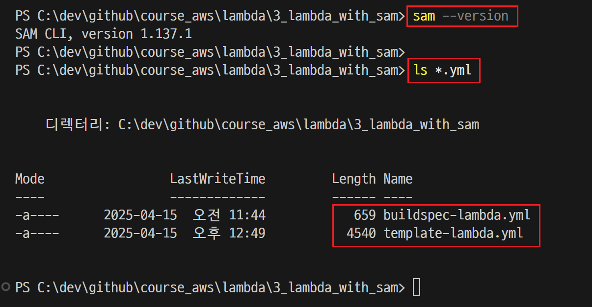
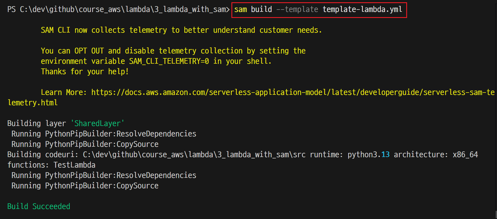
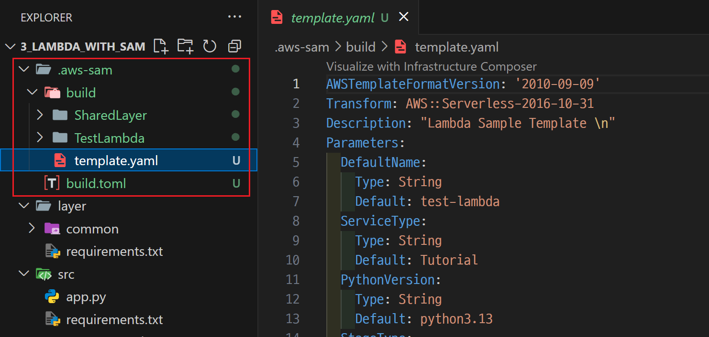
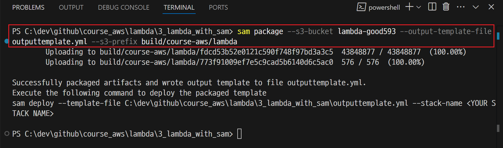
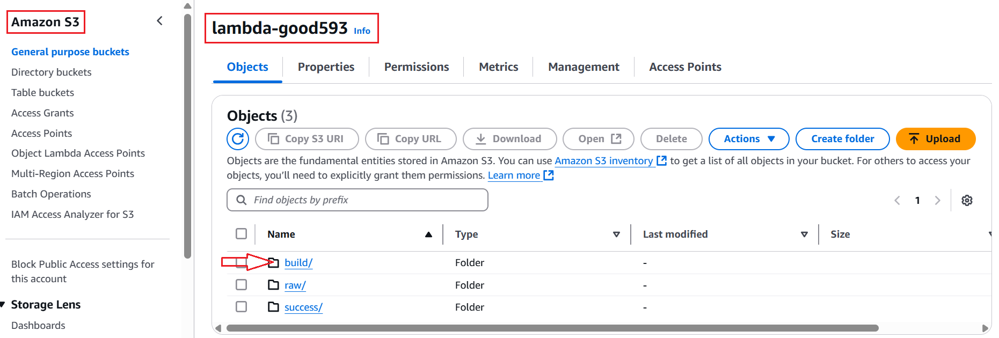

# Local PC

---
### 단계1: yml파일이 있는 폴더로 이동 
```shell
sam --version # sam 설치 확인 
ls *.yml # yml 파일 확인 
```


---
### 단계2: AWS SAM build
```shell
sam build --template template-lambda.yml
```


---


---
### 단계3: AWS SAM package
```shell
sam package --s3-bucket lambda-good593 --output-template-file outputtemplate.yml --s3-prefix build/course-aws/lambda
```


---



