# 코드 설명 및 수정 

---
## 파이썬 코드 
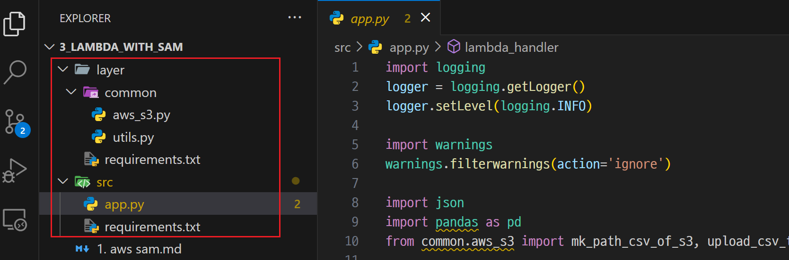

---
### layer 폴더 
- lambda layer 서비스에 적용되는 코드 
- requirements.txt 파일을 이용하여 관련된 필요한 모듈과 같이 빌되됨  

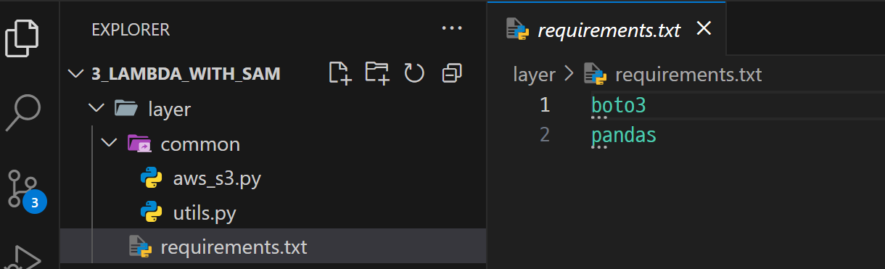

---
### src 폴더 > 코드 수정
- `bucket_name을 생성된 bucket명으로 수정`
- lambda 서비스에 적용되는 코드 
- requirements.txt 파일을 이용하여 관련된 필요한 모듈과 같이 생성됨

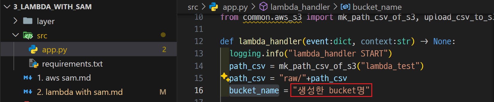

---
## buildspec-lambda.yml

---
### PACKAGE_S3_BUCKET > 코드 수정 
- `생성된 bucket명으로 수정`
- 빌드 과정에서 사용할 변수들을 사전에 정의

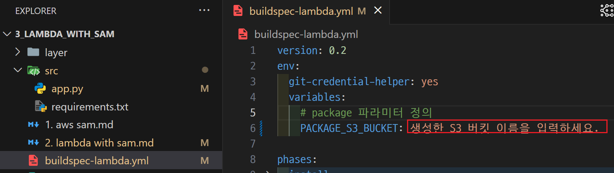

---
### build > 코드 수정 
- github에 등록된 파일 path 확인 

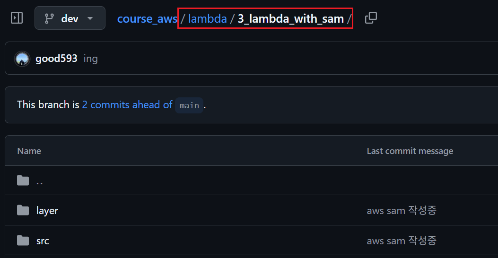

---
- `github에 등록된 파일 path에 맞게 수정` 
- sam을 이용해서 코드를 빌드하는 코드

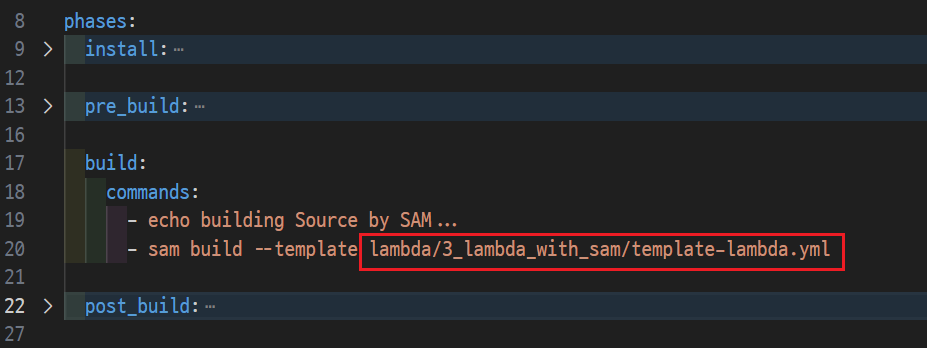

---
### post_build > 코드 수정 
- `aws s3에 저장될 path 정의` 
- 빌드된 데이터를 s3에 업로드하는 코드 

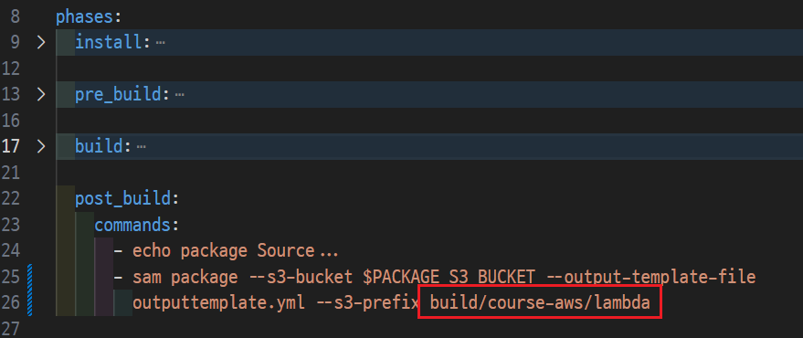

---
# Local PC

---
### 단계1: yml파일이 있는 폴더로 이동 
```shell
sam --version # sam 설치 확인 
ls *.yml # yml 파일 확인 
```
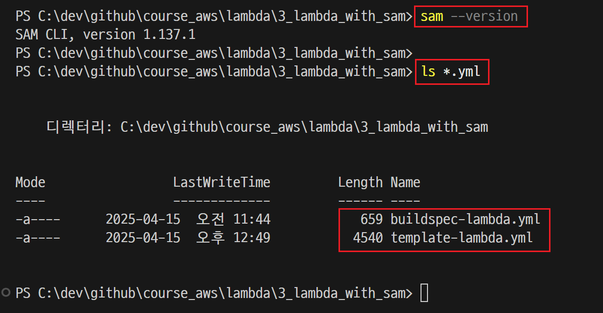

---
### 단계2: AWS SAM build
```shell
sam build --template template-lambda.yml
```
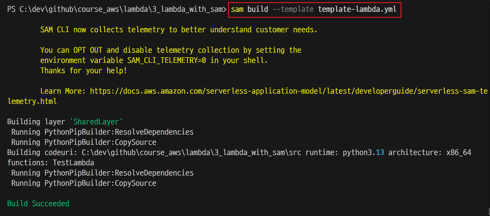

---
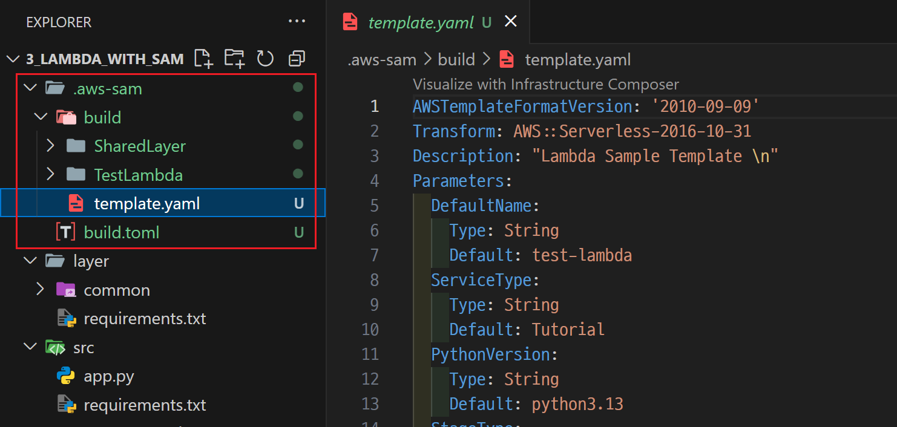

---
### 단계3: AWS SAM package
```shell
sam package --s3-bucket [aws s3 bucket명] --output-template-file outputtemplate.yml --s3-prefix build/course-aws/lambda
```
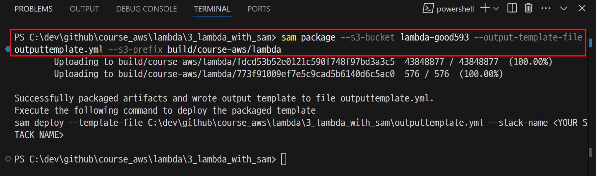

---
### 단계4: AWS S3에서 해당 데이터 확인 
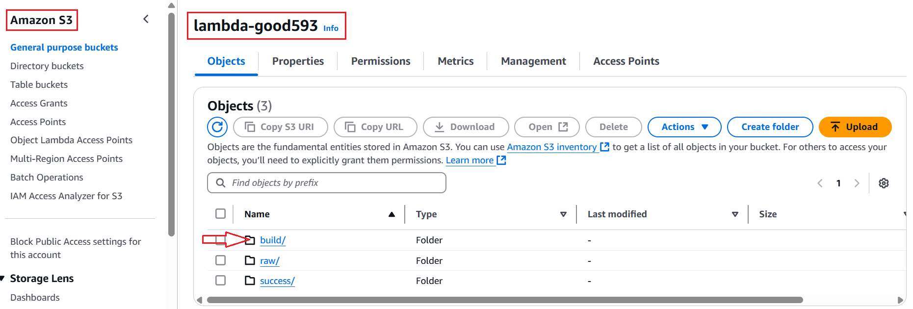


