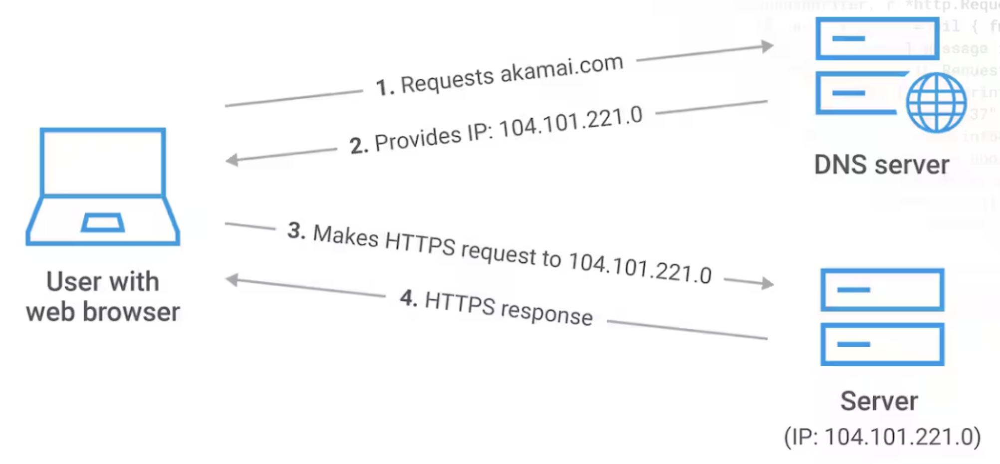

# [Domain Name System](https://www.akamai.com/ko/glossary/what-are-dns-servers)
- `DNS` 또는 `Domain Name System`은 사람이 읽을 수 있는 도메인 이름(예: www.amazon.com)을 머신이 읽을 수 있는 IP 주소(예: 192.0.2.44)로 변환합니다.

---

