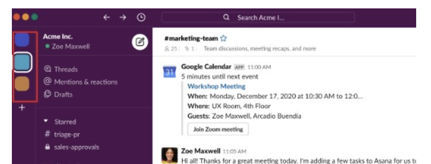

# [Slack이란?](https://www.clvs.co.kr/post/salesforce-and-slack1)
> "모든 대화와 지식을 위한 검색 가능한 로그"
> (Slack - Searchable Log of All Conversation and Knowledge)

- Slack은 팀과 업무를 하나로 이어주는 단일 플랫폼입니다.
- Slack은 클라우드 기반의 팀 협업 도구로, 실시간 메시지, 파일 공유, 작업 관리등 많은 기능들을 제공하여 사람들이 한 곳에서 통합된 하나의 팀을 운영하여 조직이 커뮤니케이션하는 방법을 개선할 수 있습니다.

즉, 업무에 관련된 모든 커뮤니케이션이 한 곳으로 집중되어 빠른 업무 확인 및 의사 결정이 가능하여 이메일을 대체할 수 있는 커뮤니케이션 도구입니다.

---
# [Slack 비용](https://slack.com/intl/ko-kr/pricing/paid-vs-free)

---
### [유로 플랜](https://app.slack.com/plans/T0204KUD676?geocode=ko-kr)

---
# [Slack 사용법](https://new-step.tistory.com/entry/%EC%8A%AC%EB%9E%99%EC%8B%9C%EC%9E%91%ED%95%98%EA%B8%B0%EB%8B%A4%EC%9A%B4%EB%A1%9C%EB%93%9C%EB%B9%84%EC%9A%A9%EA%B8%B0%EB%B3%B8%EC%82%AC%EC%9A%A9%EB%B2%951) 

---
### 워크스페이스(workspace)
- 워크스페이스는 사람들이 협업하는 장소입니다. 워크스페이스를 생성하면 워크스페이스 주 소유자가 됩니다. 좌측에 있는 부분이 워크스페이스입니다.

---
### 채널(channel)
- 채널은 특정 주제나 프로젝트, 팀을 위한 전용 공간입니다. 메시지 내역을 한눈에 볼 수 있어서 필요한 정보를 쉽게 찾을 수 있습니다.

---
- 다음과 같이 어떤 대화가 오고 갔는지 날짜 및 시간별로 알 수 있습니다.

---
- 파일 및 미디어 공유가 가능합니다.

---
- 이모티콘, 멘션 등을 이용하여 커뮤니케이션이 가능합니다.

---
### 스레드(thread)
- Thread는 Slack의 메시지 내에서 특정 메시지에 대한 응답을 별도의 대화 스레드로 구성하는 기능입니다.
- 이를 통해 주요 대화 흐름을 방해하지 않고, 즉정 주제나 메시지에 대한 토론을 따로 진행할 수 있습니다. 

---
### 알림 및 베지 
- 다음과 같이 멘션된 사람에게 (1) 표시가 뜹니다. 누군가 여러분을 멘션하거나 DM을 보내면 다음과 같이 배지가 표시됩니다. 

---
### 기타 메시지 작성 
- 키보드 입력보다 직접 말하는 것이 더 편하다면, 허들 기능을 사용하여 대화에 참여해볼 수 있습니다.

---
# [Slack 가입](https://slack.com/intl/ko-kr/help)

