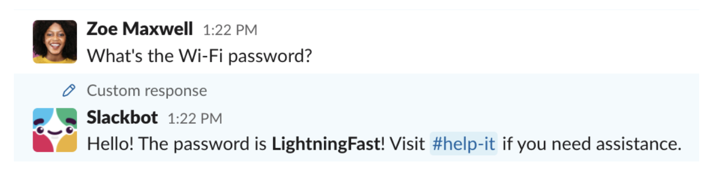
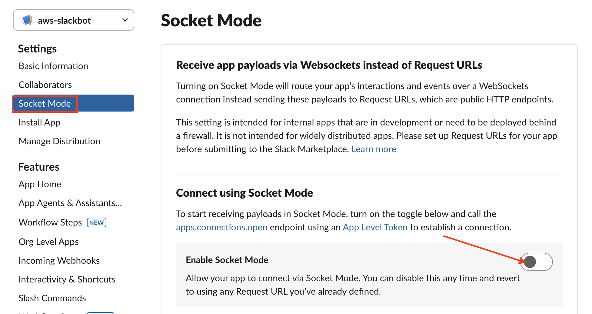
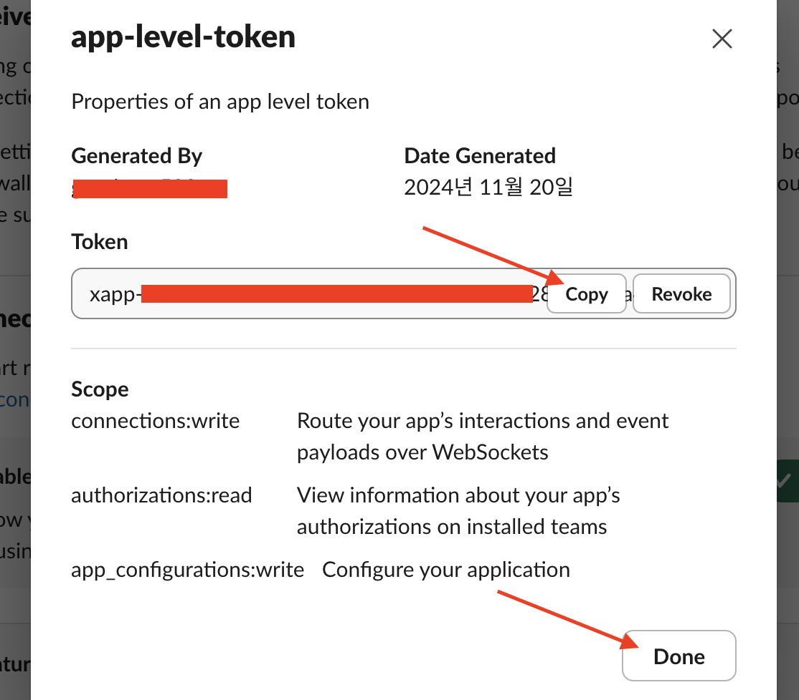

# [Slack Bot](https://slack.com/intl/ko-kr/help/articles/202026038-Slackbot-%EC%86%8C%EA%B0%9C)
- Slackbot은 도우미와 메신저 역할을 수행하며, 직장 동료와 함께하는 다이렉트 메시지(DM)나 채널에서 여러 가지 일을 돕습니다.



---
## [Slack Bot 생성](https://velog.io/@soyean/Slack-Api-Bots-%EB%A7%8C%EB%93%A4%EA%B8%B0-%EB%A9%94%EC%8B%9C%EC%A7%80-%EC%A0%84%EC%86%A1%ED%95%98%EA%B8%B0#python-%EC%BD%94%EB%93%9C%EB%A1%9C-%EB%A9%94%EC%84%B8%EC%A7%80-%EC%A0%84%EC%86%A1%ED%95%98%EA%B8%B0)


---
### 단계1: [Create an App](https://api.slack.com/apps)


---


---


---
- 생성 성공 


---
### 단계2: KEY > SLACK_SIGNING_SECRET
- 해당 토큰은 Python에서 사용할 예정 


---
### 단계3: Set Permissions


---


---
- `chat:write` 권한 추가 


---
### 단계4: Install to WorkSpace


---


---


---
### 단계5: KEY > SLACK_BOT_TOKEN
- 해당 토큰은 Python에서 사용할 예정 


---
### 단계6: Redirect URLs
```shell
https://oauth.pstmn.io/v1/browser-callback
```


---


---
### 단계7: KEY > SLACK_APP_TOKEN


---


---


---
- 해당 토큰은 Python에서 사용할 예정 



---
## Slack bot 꾸미기

---
### 단계1: [무료 아이콘 다운로드](https://www.flaticon.com/kr/)


---
### 단계2: 아이콘 적용하기 


---


---


---
### 단계3: Slack에서 확인하기 


---
## [Event Subscriptions](https://api.slack.com/apis/events-api)
- 생성한 Slack Bot과 Python Chatbot을 활용하여 여러 Event를 처리할 수 있습니다.

---
### 단계1: Enable Events


---
### 단계2: Subscribe to bot events
- `message.channels`
  - 해당 App/Bot이 추가된 public channel의 메시지를 Listen 합니다.
- `message.groups`
  - 해당 App/Bot이 추가된 private channel의 메시지를 Listen 합니다.
- `message.im`
  - 해당 App/Bot이 추가된 DM의 메시지를 Listen 합니다.
- `message.mpim`
  - 해당 App/Bot이 추가된 Multi-person DM의 메시지를 Listen 합니다.

---


---


---
### 단계3: reinstall slack bot


---

