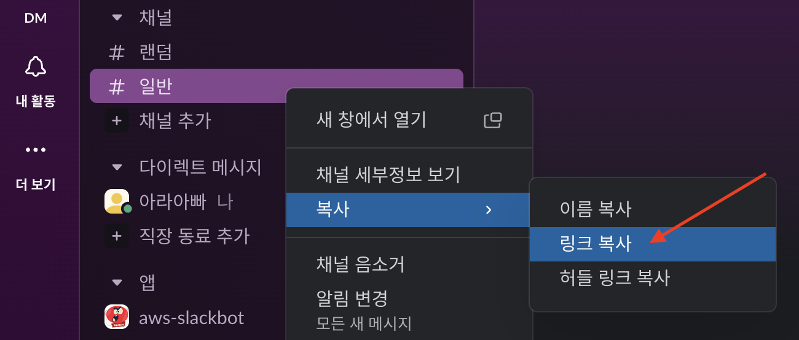

# [Slackbot with Python](https://velog.io/@soyean/Slack-Api-Bots-%EB%A7%8C%EB%93%A4%EA%B8%B0-%EB%A9%94%EC%8B%9C%EC%A7%80-%EC%A0%84%EC%86%A1%ED%95%98%EA%B8%B0#%EC%95%B1-%EC%83%9D%EC%84%B1)


---
## [Alarm 예제](https://tools.slack.dev/python-slack-sdk/web)

---
### 단계1: Slack 모듈 설치 
```shell
python -m pip install --upgrade pip
pip install slack_sdk
```


---
### 단계2: 채널 아이디 확인 및 적용 
```shell
# https://aws-slack-tutorial.slack.com/archives/채널아이디 
https://aws-slack-tutorial.slack.com/archives/C01V5MJUQ3Y
```


---


---
### 단계3: 체널에 슬렉 봇 추가  


---


---


---
### 단계3: alarm.py 확인 
```python
...
# 슬렉서버로 메세지를 전달할 객체 
client = WebClient(token=os.environ.get('SLACK_BOT_TOKEN', None))
# 해당 채널에 메세지 전달 
result = client.chat_postMessage(
  channel=p_channel_id, # 채널 아이디 
  text=p_message # 전달할 메세지 
)
...
```
---


---
### 단계4: alarm.py 실행 


---
### 단계5: slack에서 확인 


---
## [Event 예제](https://tools.slack.dev/bolt-python/getting-started)

---
### 단계1: Slack 모듈 설치 
```shell
python -m pip install --upgrade pip
pip install slack_bolt
```


---
### 단계2: event.py 확인 
```python
...
app = App(
  token=os.environ.get('SLACK_BOT_TOKEN', None),
  signing_secret=os.environ.get('SLACK_BOT_TOKEN', None)
)

@app.message("hello")
def message_hello(message, say):
    say(f"Hey there <@{message['user']}>!")
...

```
---
### 단계3: event.py 실행 


---
### 단계4: slack에서 확인 


---
# [Slack - Block Kit](https://api.slack.com/reference/block-kit/blocks)


