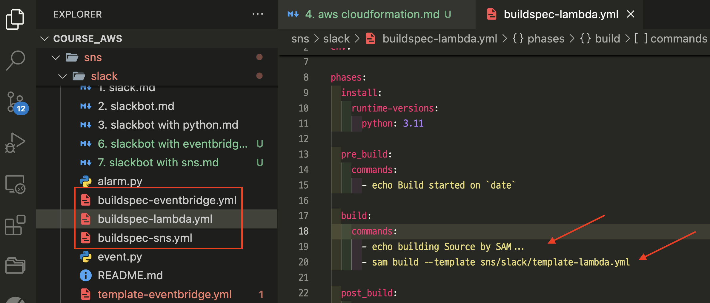
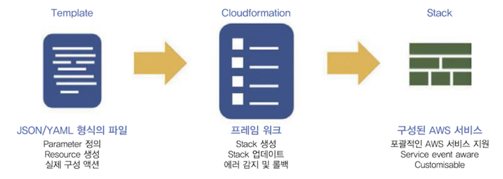
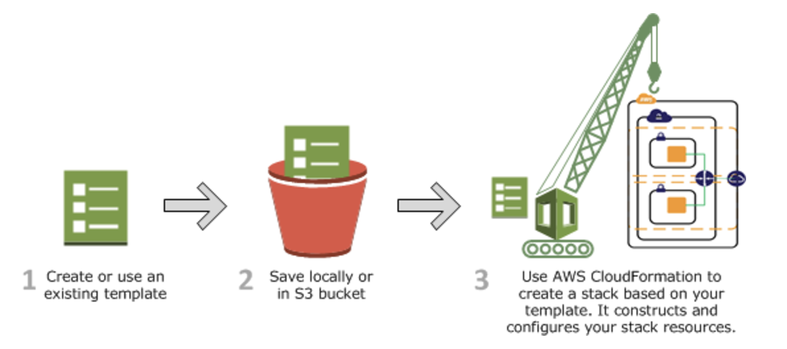
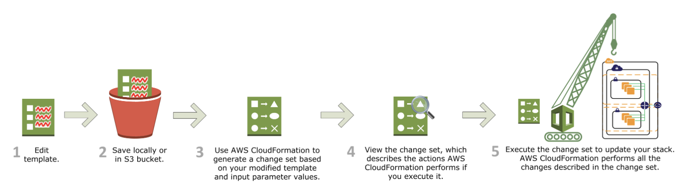
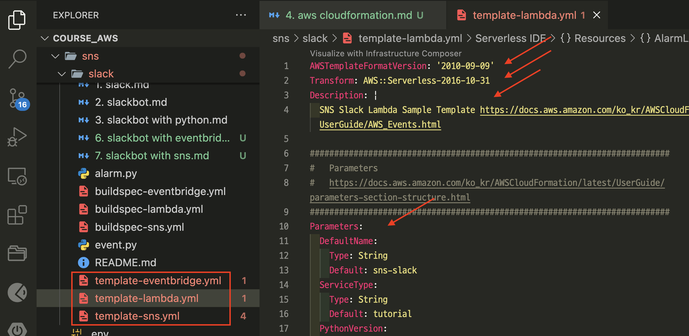
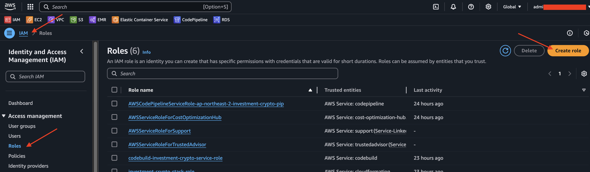
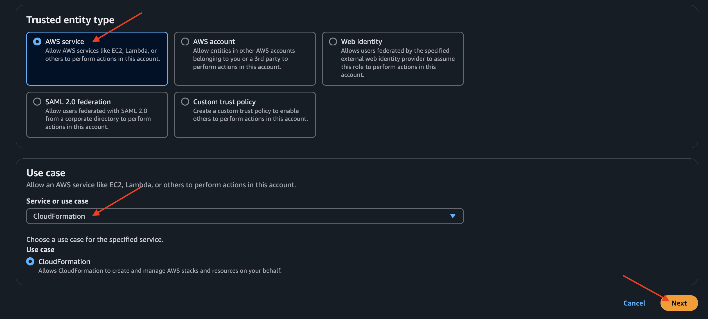
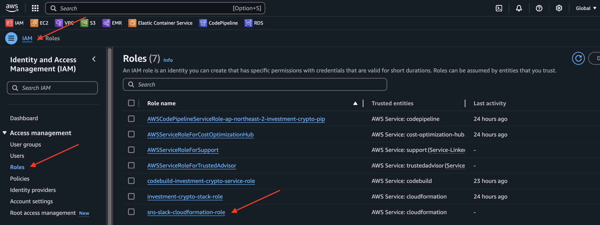

# [AWS Serverless Application Model(AWS SAM)](https://docs.aws.amazon.com/ko_kr/serverless-application-model/latest/developerguide/what-is-sam.html)
- `AWS Serverless Application Model(AWS SAM)`은 코드형 인프라(IaC)를 사용하여 서버리스 애플리케이션을 빌드하기 위한 오픈 소스 프레임워크입니다. 
- 개발자는 `AWS SAM`의 간편 구문을 사용하여 배포 중에 인프라로 변환되는 `AWS CloudFormation` 리소스와 특수한 서버리스 리소스를 선언합니다.

---
## 주요 기능
- 더 적은 코드를 사용하여 애플리케이션 인프라 코드 빠르게 정의하기
  - AWS SAM 템플릿을 작성하여 서버리스 애플리케이션 인프라 코드를 정의합니다. 
  - AWS CloudFormation에 템플릿을 직접 배포하여 리소스를 프로비저닝합니다.
- 전체 개발 수명 주기에 걸쳐 서버리스 애플리케이션을 관리합니다.
  - 개발 수명 주기의 작성, 구축, 배포, 테스트 및 모니터링 단계에 걸쳐 서버리스 애플리케이션을 관리하려면 AWS SAM CLI를 사용합니다. 
- AWS SAM 커넥터를 사용하여 리소스 간에 권한을 신속하게 프로비저닝
  - AWS SAM 템플릿의 AWS SAM 커넥터를 사용하여 AWS 리소스 간 권한을 정의합니다. 
  - AWS SAM은 코드를 의도를 달성하는 데 필요한 IAM 권한으로 변환합니다.
- 개발 과정에서 로컬 변경 사항을 클라우드에 지속적으로 동기화
  - AWS SAM CLI sam sync명령을 사용하면 로컬 변경 사항을 클라우드에 자동으로 동기화하여 개발 및 클라우드 테스트 워크플로의 속도를 높일 수 있습니다. 

---
## [주요 명령어](https://docs.aws.amazon.com/ko_kr/serverless-application-model/latest/developerguide/serverless-getting-started-hello-world.html)
### 애플리케이션 빌드 명령어
```shell
$ sam build # 빌드
...
Running PythonPipBuilder:CleanUp
Running PythonPipBuilder:ResolveDependencies
Running PythonPipBuilder:CopySource
Running PythonPipBuilder:CopySource

Build Succeeded
...
```
---
### buildspec.yml
```yaml
...
  build:
    commands:
      - echo building Source by SAM...
      - sam build --template sns/slack/template-lambda.yml
...
```


---
# [AWS CloudFormation](https://docs.aws.amazon.com/ko_kr/AWSCloudFormation/latest/UserGuide/Welcome.html)
- `AWS CloudFormation`은 AWS 리소스를 모델링하고 설정하여 리소스 관리 시간을 줄이고 AWS에서 실행되는 애플리케이션에 더 많은 시간을 사용하도록 해 주는 서비스입니다.

---
## [구성요소](https://nearhome.tistory.com/117)


---
## [작동 방식](https://docs.aws.amazon.com/ko_kr/AWSCloudFormation/latest/UserGuide/cloudformation-overview.html)
1. 구성하고자 하는 인프라에 대한 리소스를 JSON 또는 YAML 형식의 템플릿으로 작성한다.
2. 작성한 템플릿을 S3 혹은 로컬에 저장한다.
3. 템플릿 파일의 위치를 지정하여 스택을 생성하고 리소스를 구성한다.



---
## 변경 세트로 스택 업데이트
1. 템플릿을 수정한다.
2. 수정된 템플릿을 S3 혹은 로컬에 저장한다.
3. CloudFormation은 수정된 템플릿 혹은 파라미터를 기반으로 변경 세트(Change Set)을 생성한다.
4. 변경 세트를 통해 변경 사항을 확인 후 변경 세트를 실행시킨다.
5. 실행된 변경 세트는 스택을 업데이트한다.



---
## template.yml
```yaml
AWSTemplateFormatVersion: '2010-09-09'
Transform: AWS::Serverless-2016-10-31
Description: |
  설명글 

Parameters: # Resources에서 사용할 변수선언 
  ...

Resources: # aws에 구축할 리소스 정의 
  ...
```


---
## AWS Cloudformation Role 생성 

---
### 단계1: IAM > Create role


---


---
### 단계2: Add Permissions
```text
AWSCloudFormationFullAccess
IAMFullAccess
AmazonEventBridgeFullAccess
AmazonS3FullAccess
AWSLambda_FullAccess
CloudWatchEventsFullAccess
CloudWatchFullAccess
```
---
### 단계3: 결과 확인 


