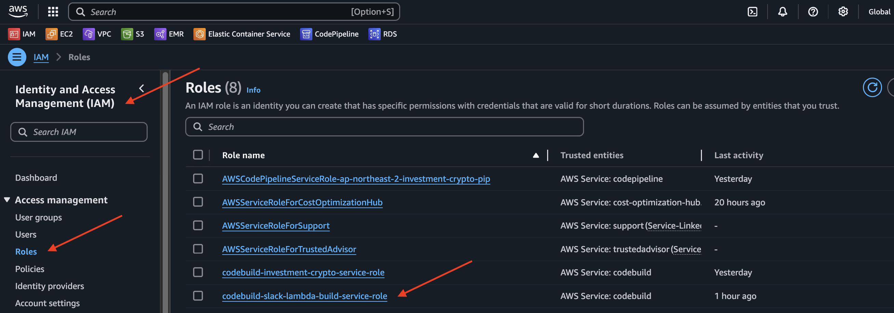
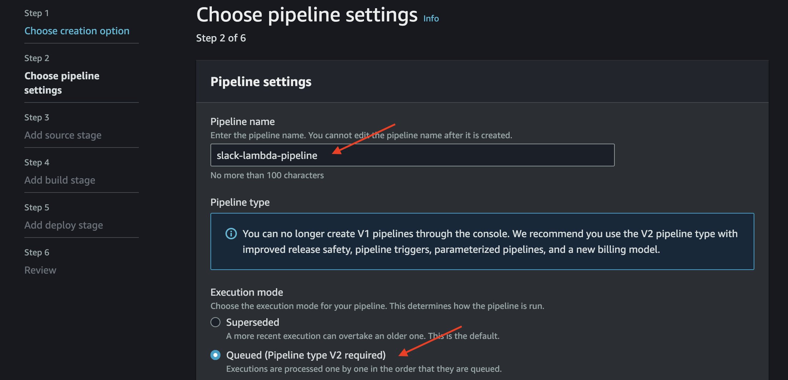
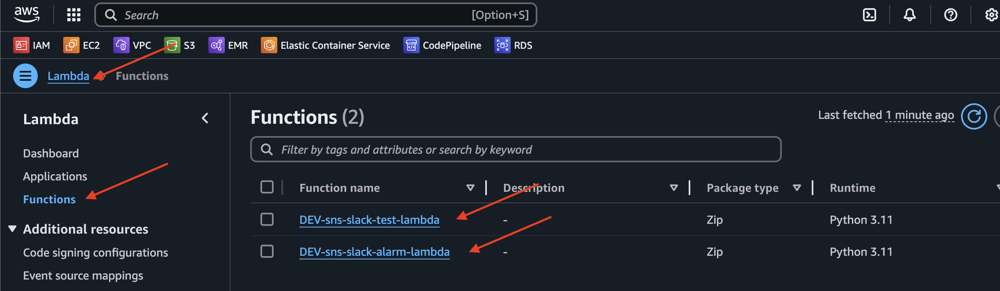

# [AWS Lambda](https://www.smileshark.kr/post/all-about-aws-lambda-the-complete-beginners-guide-1)
- Lambda는 AWS가 제공하는 서버리스 FaaS 솔루션으로, 함수의 인스턴스를 실행하여 이벤트를 처리합니다.
- [AWS Lambda 요금](https://aws.amazon.com/ko/lambda/pricing/)

---
## 서버리스란?
- 서버리스 컴퓨팅이란 서버의 설정과 관리 없이 백엔드 서비스를 운영할 수 있게 해주는 클라우드 컴퓨팅 실행 모델입니다. 
- 사용자는 코드 작성에만 집중하고, 나머지 인프라 관리는 AWS가 담당하게 됩니다. 
- 이는 개발자가 인프라에 대한 고민 없이, 더 빠르고 효율적으로 애플리케이션을 개발하고 배포할 수 있게 해줍니다.

---
## [FaaS란?](https://genezio.com/blog/faas-vs-paas/#should-you-consider-faas)
- FaaS(Function-as-a-Service)는 개발자가 자체 인프라를 유지관리할 필요 없이 애플리케이션 패키지를 기능으로 빌드, 실행, 관리할 수 있게 해주는 일종의 클라우드 컴퓨팅 서비스입니다.
- FaaS 기능에는 특히 상태 및 실행 기간과 관련하여 상당한 아키텍처 제한이 있습니다.

---

---
## AWS Lambda의 작동 원리

---
### 람다 함수
- 함수는 Lambda에서 코드를 실행하기 위해 호출할 수 있는 리소스입니다.
- 함수에는 함수에 전달하는 이벤트 또는 다른 AWS서비스에서 보낸 이벤트를 처리하는 코드가 포함되어 있습니다.

### 이벤트 트리거(이벤트 소스)
- AWS Lambda는 이벤트를 처리하기 위해 함수 인스턴스를 실행합니다. 함수는 Lambda API를 사용하여 직접 호출할 수 있으며 AWS 서비스 및 리소스를 설정하여 함수를 호출할 수도 있습니다.
- AWS Lambda 함수는 HTTP 요청, 데이터 상태 번역, 파일 업로드 등 다양한 이벤트에 의해 트리거 됩니다.

---
### 람다의 작동 방식 
1. 먼저 함수를 생성하고, 해당 함수를 사용되는 프로그래밍 언어와 같은 기본 정보를 서비스에 추가합니다. 
2. 그런 다음 람다 편집기에서 코드를 작성하거나 소스 코드를 zip 파일로 업로드합니다. 
3. 람다 코드가 업로드되면 서비스가 모든 용량 확장, 패치 및 인프라 관리를 처리합니다.

---
## AWS Lambda와 EC2의 차이점

---
## AWS Lambda의 사용 사례

### 시스템 운영 자동화 

---
### 웹 애플리케이션

---
### Serverless Batch Processing

---
# aws codepipeline

---
## CodeBuild

---
### 단계1: CodeBuild 생성 

---
### 단계2: CodeBuild Role 권한 추가 

---

---
### 단계3: CodeBuild 실행 

---
## CodePipeline

---
### 단계1: CodePipeline 생성 및 실행 

---

---

---

---

---

---

---
### 단계2: CodePipeline 실행 결과 확인 

---
### 단계3: Cloudformation 실행 결과 확인 

---

---
### 단계4: IAM 실행 결과 확인 

---

---
### 단계5: Lambda 실행 결과 확인 

---

---
# aws lambda 테스트 

---
### 단계1: lambda 선택 

---
### 단계2: Test 실행

---

---
### 단계3: Test 결과 확인 

---

---
# (옵션) Cloudformation으로 생성된 모든 리소스 삭제 

---

