# [Amazon Simple Notification Service](https://velog.io/@soyeon207/AWS-SNS-SQS-%EB%9E%80)
- `Amazon Simple Notification Service(Amazon SNS)`는 구독 중인 서비스나 사용자에게 메시지 전달 및 전송을 해주는 서비스입니다.
- `메시지를 처리하는 곳(Publisher)`과 `수신하는 곳(Subscriber)`을 분리하는 비동기 메시징 서비스를 제공하는 완전관리형 서비스입니다.

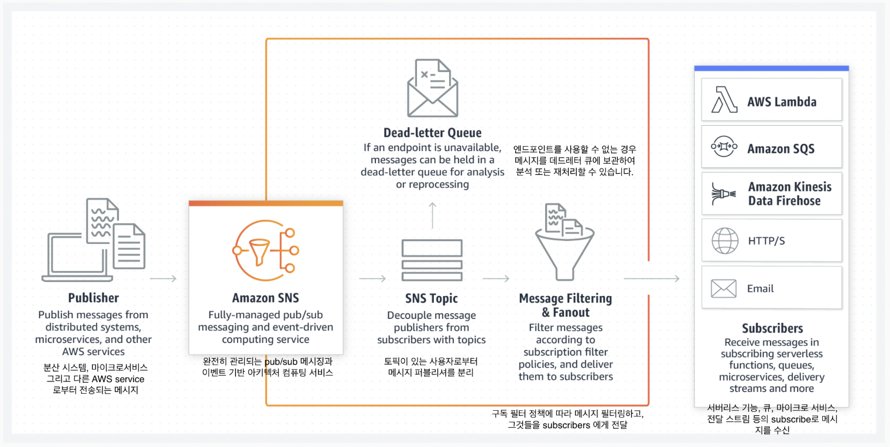

---
## [Amazon SNS 구성요소](https://galid1.tistory.com/382)
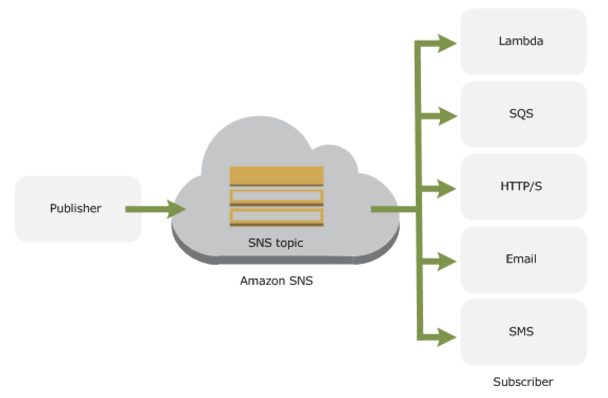

---
- Topic (토픽)
  - SNS는 토픽이라는 기능을 통해 메시지를 보낸다.
  - 위와 같은 구조를 통해 비동기통신(Asynchronous)을 실현시킨다.
- Publisher (발행자)
  - Publisher는 Amazon SNS에서 메시지를 발신하는 애플리케이션 등을 의미한다. 
  - Publisher는 메시지를 발행하고자 하는 Topic을 선택하여 메시지를 배포한다. 
  - Subscriber의 존재나 프로토콜의 종류 등은 신경 쓸 필요가 없다.
- Subscriber (구독자)
  - Subscriber는 메시지를 수신하는 (구독하는) 애플리케이션이나 사용자이다.

---
## [Amazon 단순 알림 서비스 엔드포인트 및 할당량](https://docs.aws.amazon.com/ko_kr/general/latest/gr/sns.html)
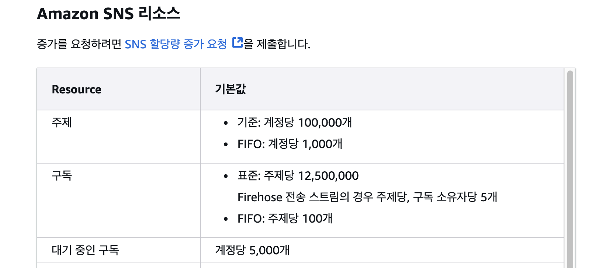

---
# aws codepipeline
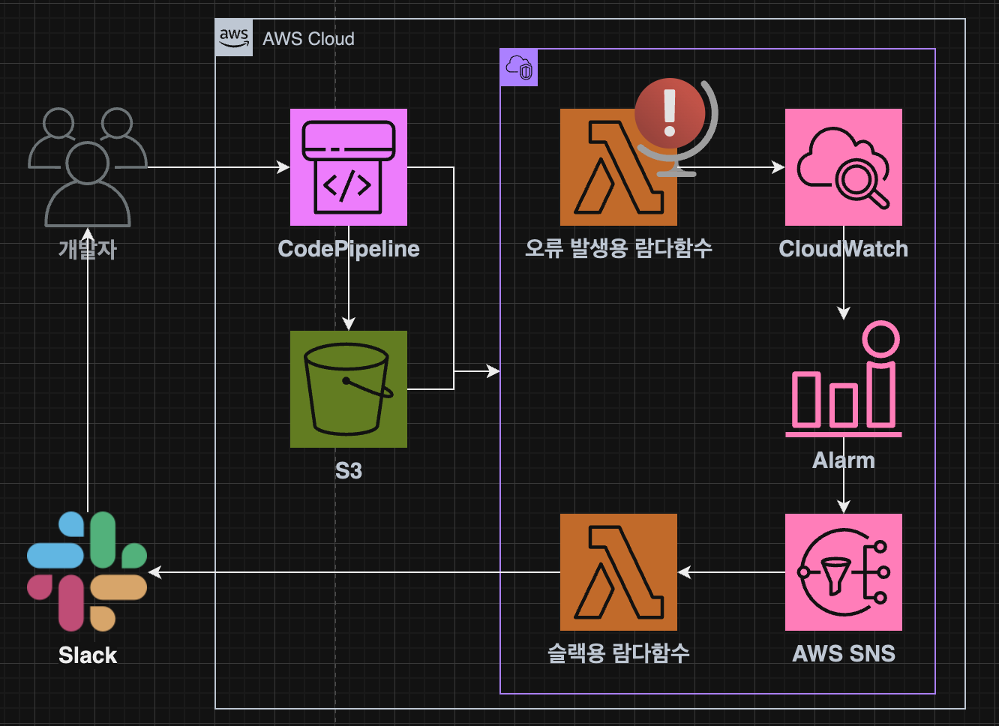

---
## CodeBuild

---
### 단계1: CodeBuild 생성 
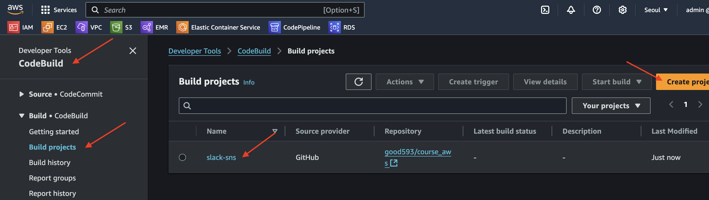

---
### 단계2: CodeBuild Role 권한 추가 
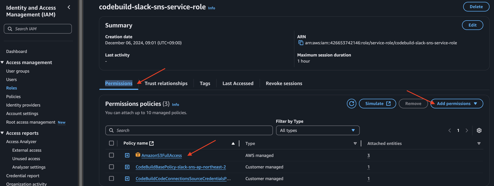

---
### 단계3: CodeBuild 실행
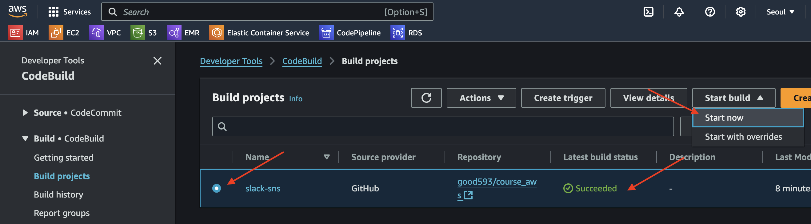

---
## CodePipeline

---
### 단계1: CodePipeline 생성 및 실행 
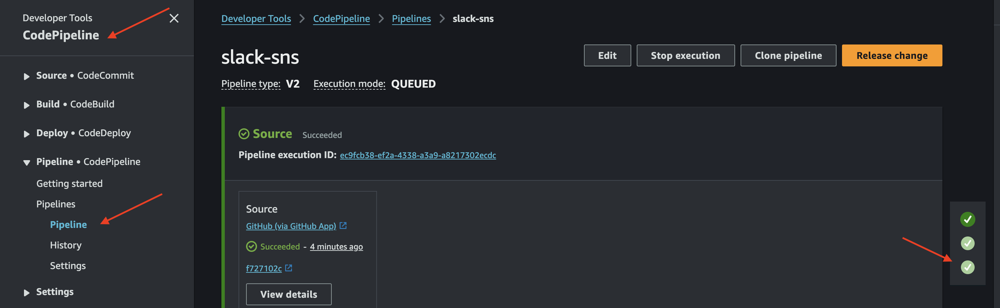

---
### 단계2: Cloudformation 확인 
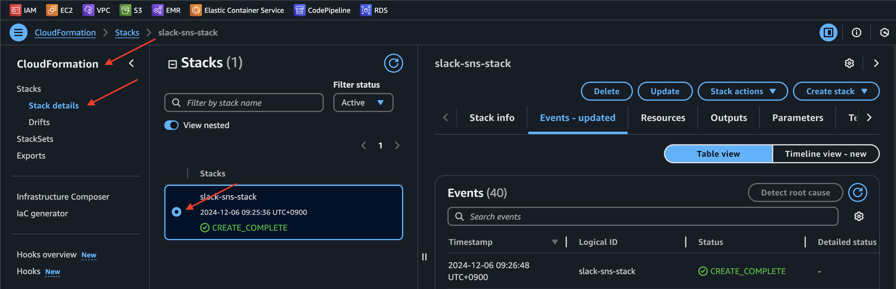

---
### 단계3: IAM 확인
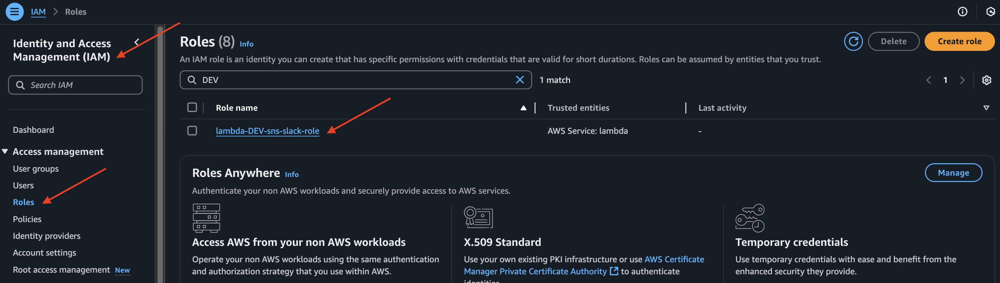

---
### 단계4: SNS 확인 
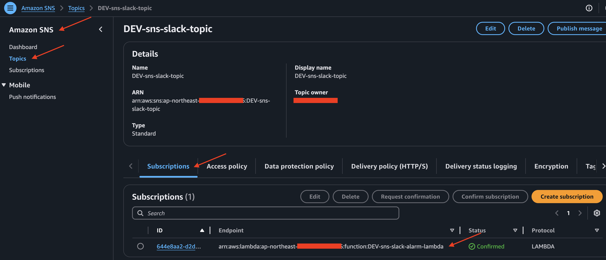

---
## Alarm Test

---
### 단계1: AWS Lambda n번 오류 발생 시킴 
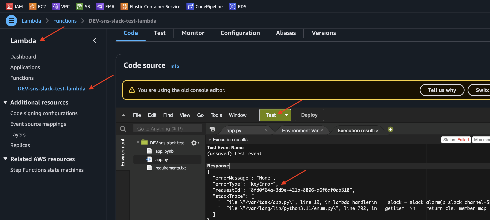

---
### 단계2: AWS CloudWatch > Alarm 확인(1분 이상 기다려야함)
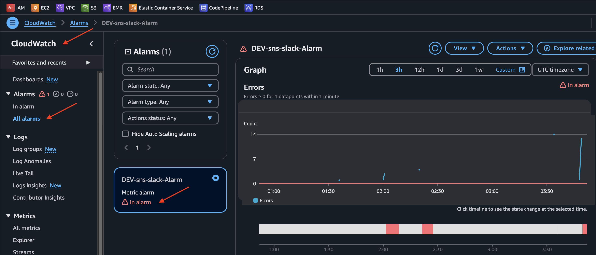

---
### 단계3: Slack에서 오류 메세지 확인 
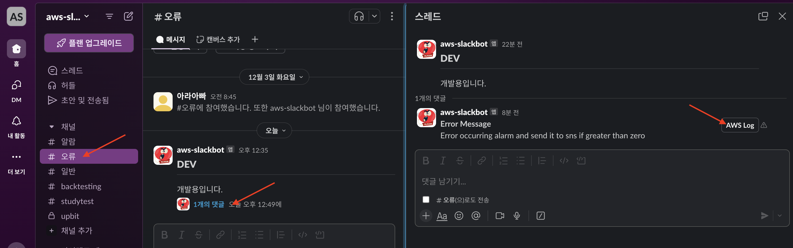

---
### 단계4: Slack 버튼을 이용하여 AWS Log 접속
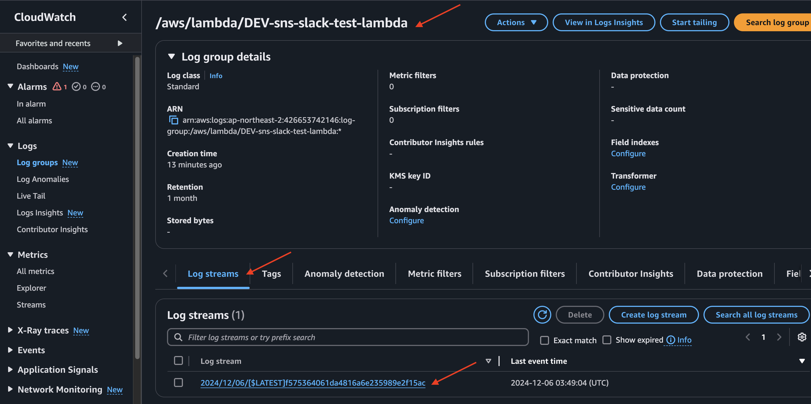

---
### 단계5: Error Log 확인 
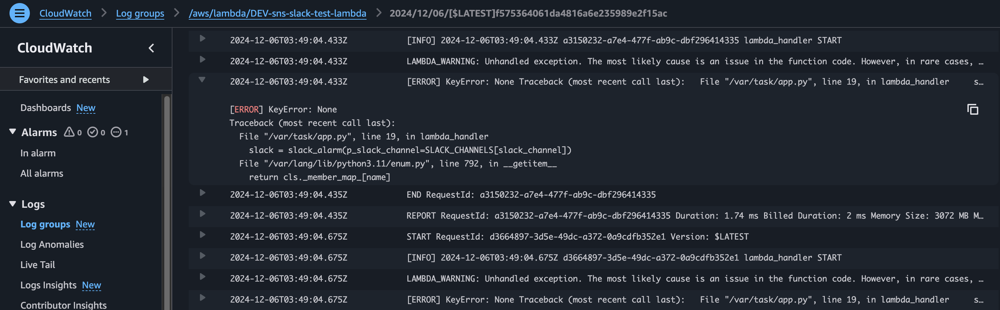

