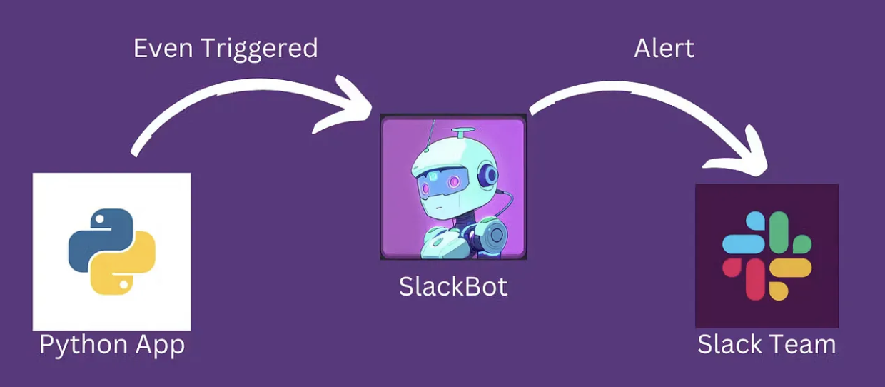
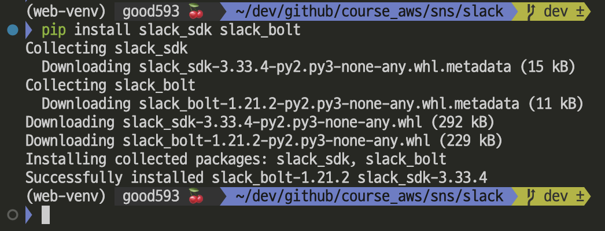

# [Slackbot with Python](https://velog.io/@soyean/Slack-Api-Bots-%EB%A7%8C%EB%93%A4%EA%B8%B0-%EB%A9%94%EC%8B%9C%EC%A7%80-%EC%A0%84%EC%86%A1%ED%95%98%EA%B8%B0#%EC%95%B1-%EC%83%9D%EC%84%B1)


---
### 단계1: Slack 모듈 설치 
```shell
python -m pip install --upgrade pip
pip install slack_sdk slack_bolt
```


---


