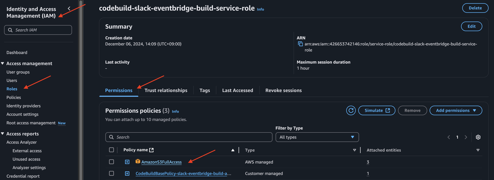

# [Amazon EventBridge](https://aws.amazon.com/ko/eventbridge/)
- Amazon EventBridge는 AWS의 리소스 상태 변화나 스케줄링(특정 시간)에 따라 작업을 실행할 수 있는 서비스이다.
- Amazon EventBridge는 다양한 소스(AWS 서비스, 애플리케이션 등)에서 이벤트를 수집하고, 이를 특정 AWS 서비스로 전달한다.

---
## [EventBridge의 주요 기능](https://jibinary.tistory.com/280)
- Event Source (이벤트 소스)
  - EventBridge가 이벤트를 수집하는 곳이다. 
  - 다양한 AWS 서비스, SaaS 애플리케이션 및 사용자 정의 애플리케이션에서 발생하는 이벤트를 EventBridge로 전달할 수 있다.
- Event Bus (이벤트 버스)
  - Event Bus는 다양한 Event Source에서 생긴 이벤트를 수집하고 이를 여러 Target에게 전달하는 시스템이다.
- Event Rules (이벤트 규칙)
  - 이벤트 버스에 도착한 이벤트가 어디로 전달될지 결정하는 규칙을 정의한다.
  - 규칙은 이벤트 패턴에 맞는 이벤트를 감지하여 특정 작업을 실행하도록 설정된다.
- Target (타겟)
  - EventBridge는 수집된 이벤트를 Target을 통해 다양한 AWS 서비스에 전달할 수 있다. 

---

---
## [규칙 스케줄링](https://docs.aws.amazon.com/ko_kr/eventbridge/latest/userguide/eb-scheduled-rule-pattern.html)
-  EventBridge 스케줄링된 규칙을 생성할 때 규칙 EventBridge 실행 시기를 결정하는 스케줄 패턴을 지정할 수 있습니다.
- cron 표현식을 사용하면 특정 시간과 날짜에 규칙을 실행할 수 있습니다.

---
### cron 표현식

---
### rate 표현식

---
# aws codepipeline

---
## CodeBuild

---
### 단계1: CodeBuild 생성 

---
### 단계2: CodeBuild Role 권한 추가

---
### 단계3: CodeBuild 실행

---
## CodePipeline

---
### 단계1: CodePipeline 생성 및 실행 

---
### 단계2: Cloudformation 확인 

---

